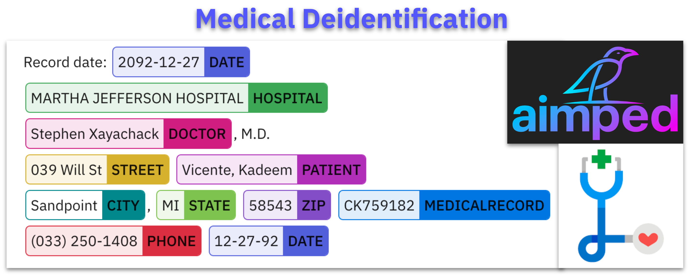
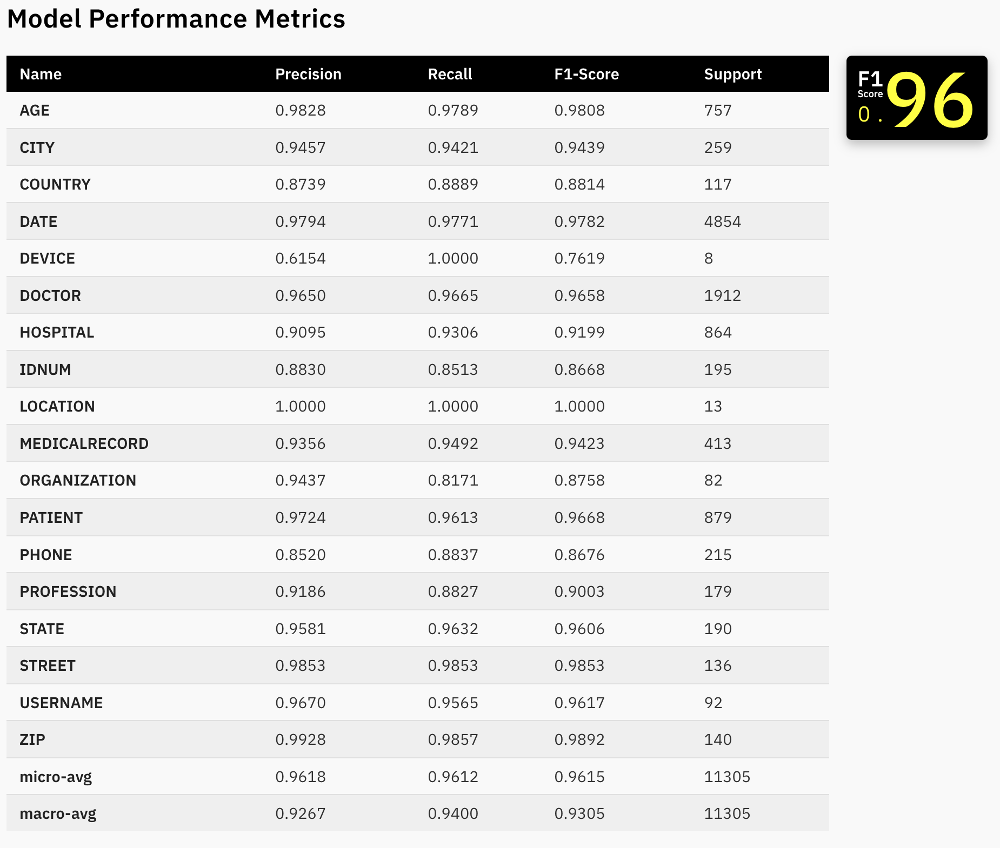
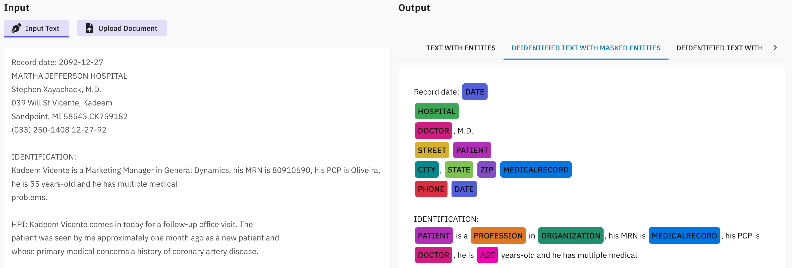
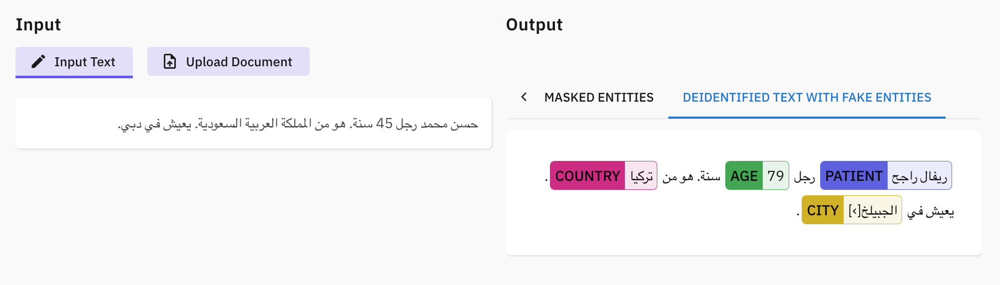

# Advancing Clinical Data Privacy with Cutting-Edge Deidentification Models

Patient data plays a crucial role in advancing public health initiatives, expanding preventive health services, preventing diseases, and formulating essential health policies. By harnessing comprehensive and anonymized patient information, researchers and healthcare professionals can gain valuable insights into the patterns, prevalence, and risk factors associated with various health conditions. This data-driven approach enables the identification of emerging health trends, facilitates the development of targeted preventive measures, and enhances the overall effectiveness of public health interventions. Moreover, access to accurate patient data empowers policymakers to make informed decisions and allocate resources strategically, thereby optimizing healthcare systems. As we navigate the complexities of modern healthcare, the responsible and ethical use of patient data emerges as a cornerstone for building a robust public health infrastructure that can address current challenges and proactively respond to the evolving health needs of communities.

In today's digital age, the healthcare industry has witnessed a massive transformation with the integration of technology and the digitization of patient records. While this advancement has undoubtedly enhanced patient care and streamlined medical processes, it has also brought forth a pressing concern – the protection of sensitive patient information. The sensitive nature of this data necessitates stringent privacy safeguards to protect patients' rights and comply with regulations like **HIPAA** (Health Insurance Portability and Accountability Act) in the United States and **GDPR** (General Data Protection Regulation) in Europe. This is where **AIMPED deidentification models** step in as an essential safeguard.

## Aimped's Cutting-Edge Deidentification Models

In the realm of healthcare research, meticulous deidentification data preparation is paramount, and this study exemplifies a rigorous approach to data labeling and preprocessing. The labeling process, conducted by a dedicated department in collaboration with healthcare professionals, adhered to the i2b2-2014 dataset labeling guidelines, ensuring accuracy and consistency. The dataset, a critical foundation for the study, underwent a thoughtful split into 80% for training and 20% for testing purposes, optimizing the model's performance. During the pre-processing phase, the "stanza" library proved instrumental for de-identification tasks in Romanian, while the versatile "NLTK" library was employed for other languages. The utilization of the "word-punc tokenizer" within "NLTK" further enhanced word tokenization. Notably, a stringent evaluation methodology, employing the strict method, was adopted to validate both the correctness of chunks and labels. This commitment to detail and precision showcases the study's dedication to robust data practices, a fundamental aspect of producing reliable and impactful research in the healthcare domain.

### Meet Aimped's Clinical Deidentification Models:

To avail yourself of these models, simply locate them by their designated names on the [AIMPED Hub](https://aimped.ai/models). Whether your requirements demand meticulous linguistic precision with the sub-level models or robust, overarching performance with the base-level counterparts, Aimped's offerings are tailored to accommodate a diverse array of needs.

- English:
nlp-health-deidentification-sub-base-en
nlp-health-deidentification-base-en
- German:
nlp-health-deidentification-sub-base-de
nlp-health-deidentification-base-de
- French:
nlp-health-deidentification-sub-base-fr
nlp-health-deidentification-base-fr
- Italian:
nlp-health-deidentification-sub-base-it
nlp-health-deidentification-base-it
- Spanish:
nlp-health-deidentification-sub-base-es
nlp-health-deidentification-base-es
- Turkish:
nlp-health-deidentification-sub-base-tr
nlp-health-deidentification-base-tr
- Romanian:
nlp-health-deidentification-sub-base-ro
nlp-health-deidentification-base-ro
- Arabic
nlp-health-deidentification-sub-base-ar

### Model's Performance

Before we delve into the capabilities of AIMPED, let's take a closer look at the labels it employs and its remarkable performance metrics on the 2014 i2b2 test set.

We used also contextual parser for ACCOUNT, PLATE, LICENSE, URL, EMAIL, FAX, IP, VIN, SSN, DLN labels. As you can see, AIMPED achieves remarkable precision, recall, and F1-score across a wide range of labels, demonstrating its excellence in deidentifying clinical data. AIMPED's performance on the 2014 i2b2 test set has catapulted it to the forefront of deidentification models. With precision and recall scores exceeding 95% in several critical categories, it has not only met but exceeded the state-of-the-art standards. This achievement is a testament to the model's sophistication and efficacy in protecting patient privacy.

### Efficient Sensitive Chunk Detection

In the example EHR text, we have various chunks of sensitive information such as the patient's name, date, medical record number, state, city, zip, hospital's name and phone number etc. We can see a clinical text where the AIMPED clinical deidentification model has efficiently detected and highlighted sensitive informations

### Masked Sensitive Information

We can observe a deidentified clinical text where sensitive information has been carefully masked. Elements such as dates, hospital names, doctor's identities, patient details, addresses, and medical record numbers have all been anonymized to protect patient privacy.

### Faked Sensitive Information

In the provided example, we encounter a deidentified clinical text with cleverly crafted fake chunks. These fictitious elements have been seamlessly inserted into the text, effectively replacing sensitive patient information. From the fabricated dates and hospital names to the pseudo-doctor and patient details, this text showcases the efficacy of the deidentification process. By employing such fake chunks, patient privacy is rigorously maintained, allowing for secure data sharing and analysis within the healthcare domain. This approach underscores the importance of protecting patient confidentiality while still enabling healthcare professionals and researchers to work with the data they need for medical research and patient care.

## Why AIMPED Deidentification Models

- **User-friendly API**: It is crucial to emphasize that AIMPED's trained models are readily accessible to developers through an API, allowing seamless integration into any application. This ensures that programmers with specific needs can easily leverage the power of models to enhance their applications. 

- **Data security**: AIMPED's commitment to data security is unwavering — none of the data processed by the models is stored in any form. This not only prioritizes AIMPED's privacy but also aligns with contemporary standards for responsible and ethical data usage. 

- **High Precision**: AIMPED excels in preserving the integrity of clinical data while effectively deidentifying sensitive information. Its high precision ensures that valuable medical context remains intact.

- **Broad Label Coverage**: AIMPED's extensive label coverage ensures that a wide array of sensitive information, from patient names to medical record numbers, can be deidentified with precision.

- **Regulatory Compliance**: By surpassing regulatory standards, AIMPED ensures that healthcare institutions can confidently share and analyze data without compromising patient privacy or facing legal consequences.

- **Facilitating Research**: AIMPED accelerates healthcare research by enabling the secure sharing of deidentified data. Researchers can collaborate across institutions and borders, driving innovation in the field.

## Conclusion
AIMPED offers a wealth of advantages, including high precision in data deidentification, comprehensive label coverage, regulatory compliance, and the facilitation of groundbreaking research. In an age where medical breakthroughs depend on the sharing and analysis of clinical data, AIMPED paves the way for innovation while safeguarding patient confidentiality.

If you're involved in the healthcare industry, medical research, or data privacy, we invite you to try out our versatile deidentification models. With AIMPED, you can ensure patient data privacy, regulatory compliance, and secure data sharing in multiple languages.

Experience the power of AIMPED's cutting-edge deidentification models and take your clinical data privacy to the next level. Visit [aimped.ai](https://aimped.ai/models) and explore these language-specific models today!
 