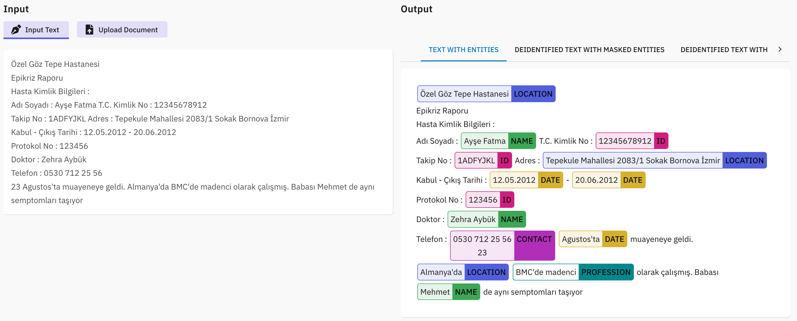

# Advancing Clinical Data Privacy with Cutting-Edge Deidentification Models
In today's digital age, the healthcare industry has witnessed a massive transformation with the integration of technology and the digitization of patient records. While this advancement has undoubtedly enhanced patient care and streamlined medical processes, it has also brought forth a pressing concern – the protection of sensitive patient information. The sensitive nature of this data necessitates stringent privacy safeguards to protect patients' rights and comply with regulations like HIPAA (Health Insurance Portability and Accountability Act) in the United States and GDPR (General Data Protection Regulation) in Europe. This is where AIMPED deidentification models step in as an essential safeguard.

## Aimped's Cutting-Edge Deidentification Models
  

  <h3>Model's Performance</h3>
  
Before we delve into the capabilities of AIMPED, let's take a closer look at the labels it employs and its remarkable performance metrics on the 2014 i2b2 test set.:

  
  
We used also contextual parser for ACCOUNT, PLATE, LICENSE, URL, EMAIL, FAX, IP, VIN, SSN, DLN labels. As you can see, AIMPED achieves remarkable precision, recall, and F1-score across a wide range of labels, demonstrating its excellence in deidentifying clinical data. AIMPED's performance on the 2014 i2b2 test set has catapulted it to the forefront of deidentification models. With precision and recall scores exceeding 95% in several critical categories, it has not only met but exceeded the state-of-the-art standards. This achievement is a testament to the model's sophistication and efficacy in protecting patient privacy.

  <h3>Clinical Text</h3>
  
  
In the example EHR text, we have various chunks of sensitive information such as the patient's name, date, medical record number, state, city, zip, hospital's name and phone number etc. Let's witness the transformation performed by AIMPED.

  <h3>Efficient Sensitive Chunk Detection</h3>
  
  
We can see a clinical text where the AIMPED clinical deidentification model has efficiently detected and highlighted sensitive chunks

  <h3>Masked Sensitive Information</h3>
  
  
we can observe a deidentified clinical text where sensitive information has been carefully masked. Elements such as dates, hospital names, doctor's identities, patient details, addresses, and medical record numbers have all been anonymized to protect patient privacy.

  <h3>Faked Sensitive Information</h3>
  
  
In the provided example, we encounter a deidentified clinical text with cleverly crafted fake chunks. These fictitious elements have been seamlessly inserted into the text, effectively replacing sensitive patient information. From the fabricated dates and hospital names to the pseudo-doctor and patient details, this text showcases the efficacy of the deidentification process. By employing such fake chunks, patient privacy is rigorously maintained, allowing for secure data sharing and analysis within the healthcare domain. This approach underscores the importance of protecting patient confidentiality while still enabling healthcare professionals and researchers to work with the data they need for medical research and patient care.

## Why AIMPED Deidentification Models

- **High Precision**: AIMPED excels in preserving the integrity of clinical data while effectively deidentifying sensitive information. Its high precision ensures that valuable medical context remains intact.

- **Broad Label Coverage**: AIMPED's extensive label coverage ensures that a wide array of sensitive information, from patient names to medical record numbers, can be deidentified with precision.

- **Regulatory Compliance**: By surpassing regulatory standards, AIMPED ensures that healthcare institutions can confidently share and analyze data without compromising patient privacy or facing legal consequences.

- **Facilitating Research**: AIMPED accelerates healthcare research by enabling the secure sharing of deidentified data. Researchers can collaborate across institutions and borders, driving innovation in the field.

## Conclusion
AIMPED offers a wealth of advantages, including high precision in data deidentification, comprehensive label coverage, regulatory compliance, and the facilitation of groundbreaking research. In an age where medical breakthroughs depend on the sharing and analysis of clinical data, AIMPED paves the way for innovation while safeguarding patient confidentiality.

In addition to our English clinical deidentification model, we're excited to announce that AIMPED also offers deidentification models in six additional languages: German, French, Italian, Romanian, Spanish, and Turkish!

If you're involved in the healthcare industry, medical research, or data privacy, we invite you to try out our versatile deidentification models. With AIMPED, you can ensure patient data privacy, regulatory compliance, and secure data sharing in multiple languages.

Experience the power of AIMPED's cutting-edge deidentification models and take your clinical data privacy to the next level. Visit [aimped.ai](https://dev.aimped.ai/models) and explore these language-specific models today!
 
