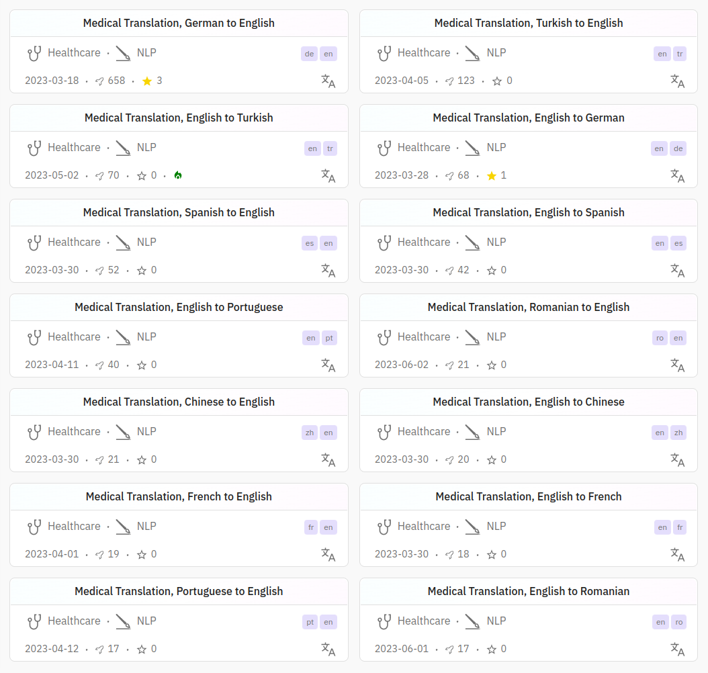
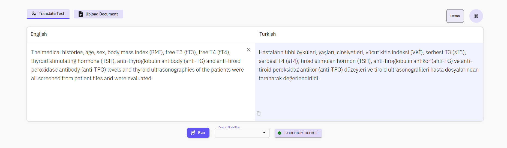

# Medical Translation Services: Bridging Language Gaps in Healthcare

  
**Medical document translation** plays a crucial role in the dissemination of health-related information globally. Health professionals and researchers continually advance their understanding, developing new treatments and medicines. The ongoing study of health relies on the swift and accurate translation of information, allowing researchers from diverse regions to access up-to-date knowledge efficiently. The process of medical document translation ensures that this vital information is conveyed accurately in various languages, facilitating seamless collaboration and knowledge exchange in the field of healthcare.

**Medical translation** is different from general translation and the accurate translation of documents such as clinical findings, patient files, research papers, and treatment guidelines plays a critical role in international medical communication. Medical translation involves not only word-for-word translation but also medical terminology, cultural differences, and disease-specific language structures. As such, it requires expertise and rigor.

**Medical machine translation models** are artificial intelligence-based systems developed to overcome these challenges. These models have the ability to translate medical documents quickly, accurately, and faithfully to specialized details between various languages. As Aimped, we have carried out meticulous work on preparing medical translation artificial intelligence models. We worked meticulously at every stage such as collecting and preparing the data and determining the architecture to be used for model training.

<h2>Data Preparation:</h2> During the collection of scientific publications published in the field of medicine and the determination of the responses of these scientific publications in source and target language and the preparation of sentence pairs, we developed and used statistical and artificial intelligence-based methods for the most accurate matching of the source and target language translations. In addition to simple statistical techniques such as the number of characters, the number of words and the ratio of them to each other, we used dozens of different techniques until the ratio of the total number of words to the number of unique words reached the similarity of the sentences in the target and source language as letters and words. In addition, using transformers architecture, we created vectors representing the meaning each sentence pair carried, and measured the similarity of meaning between sentence pairs by the cosine similarity method. We filtered our findings according to the threshold values we determined according to the feature of the language pair.

<h2>Selection of the train algorithm:</h2> We benefited from transformers architectures to train the models. Among these architectures, we decided that as a result of the tests and researches we made on the architecture of MarineMT, it is a more ideal structure to train the medical translation model.

<h2>Training the models:</h2> The process of training the models is based on a number of experiments such as training et-test et-evaluation and then updating the training arguments according to the results obtained. In addition, according to the evaluation results, we realized that each language pair showed different features. The threshold values we set in the data preparation process and used to filter the data were also models we updated and re-prepared the data.
After the training and data preparation cycle, we decided the final training parameters and trained the final models. In the table below, you can see the scores obtained by the medical translation models.

**Use areas of Medical Translation models:**

- **Medical translation experts using medical translation models:**
  
    - **Terminology Formation:** It can help to translate specific terms. It can be used to obtain information about new or specific terms.

    - **Rapid Translation Transactions:** In case of emergency situations or in case of requires speed, medical translation specialists can use these models to make a fast and basic translation. This can enable them to gain time and provide a general understanding immediately.

    - **Document Analysis:** It can be used to analyze a large amount of documents quickly. This may be useful to create a summary or to identify similarities and differences between documents.

- **Medical Faculty Students:** Medical students can translate medical resources written in various languages in accordance with the medical literature using medical translation models quickly and accurately. In this way, they can gain a wider perspective about global medicine literature and practice.

- **Academicians:** Healthcare professionals who make an academic career can improve their knowledge by examining medical research published in various sources by exceeding the language barrier. Medical translation models help academicians to overcome the problem of language in the process of understanding and learning publications and research in the field of medicine and to improve their research and increase their knowledge and experience.

- **Doctors and Health Professionals:** Physicians can examine global clinical findings and developments in cases such as pandemic epidemics rapidly over the language barrier thanks to the ability of medical translation models to translate into the medical literature. In addition, they can use medical translation models in their routine work such as new treatment methods, information about medications or disease symptoms.

- **Pharmaceutical and Drug Research Companies:** Pharmaceutical companies can translate written materials such as research, thesis, article specific to the biomedical field using the medical translation model.

**How to Use:** You can easily use our translation models for the user interface by visiting the Aimped.ai site. In addition, you can use the medical translation models effectively through the API to integrate into your applications and either to present them to your customers.

The list of Aimped AI Medical Translation Models list below. <a href="https://dev.aimped.ai/models?search=nlp-health-translation&page=1">Please click to visit models list.</a>

<ul>
    <li>English-German</li>
    <li>German-English</li>
    <li>English-French</li>
    <li>French-English</li>
    <li>English-Portuguese</li>
    <li>Portuguese-English</li>
    <li>English-Romanian</li>
    <li>Romanian-English</li>
    <li>English-Chinese</li>
    <li>Chinese-English</li>
    <li>English-Spanish</li>
    <li>Spanish-English</li>
    <li>English-Turkish</li>
    <li>Turkish-English</li>
</ul>

        
**You may want to review our <a href="https://dev.aimped.ai/models?search=nlp-legal-translation&page=1">legal translation models.</a>**

**Limitations:** Our translation model has been meticulously designed and extensively trained to cater specifically to the demanding needs of the Healthcare and Biomedical domain. While it excels within this highly specialized realm, it's important to note that if you opt to employ the model in domains outside of healthcare, its performance may not meet the exceptional standards characteristic of the medical field. We advise a thoughtful consideration of this limitation when contemplating the model's application.

