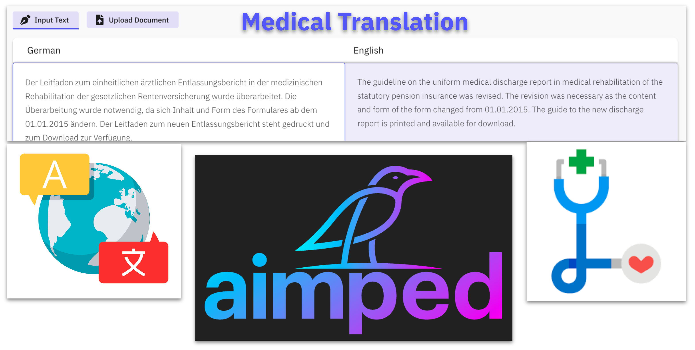
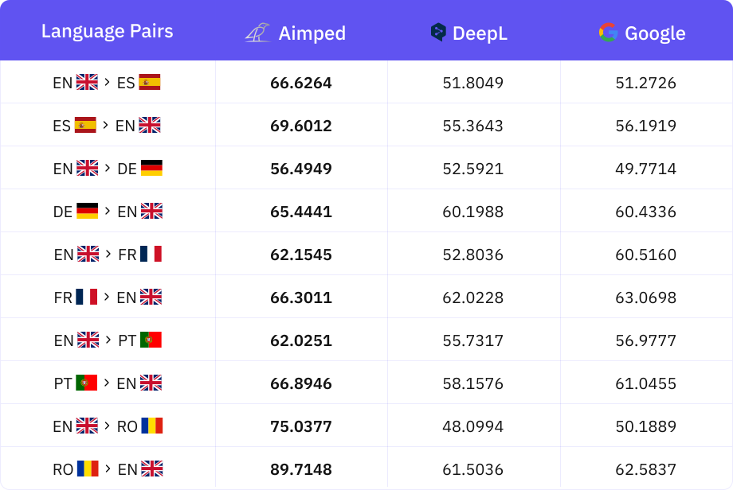

# Breaking Language Barriers in Healthcare. Aimped AI's Medical Machine Translation Models

Health is an important and sensitive issue, but it is one of the most important research areas. Day by day, health professionals and researchers find new treatment methods, develop new medicines and treatment methods. The obtained data are published as public in various medical articles platforms. In this way, researchers in different regions of the world are aware of the current developments, can learn and implement new treatment methods quickly or share new knowledge and experiences with their stakeholders.

But at this point, communication problem arises. The problem of correct translation of medical findings, discoveries and research results into different languages. Medical translation is an important and sensitive issue and contains differences and field-specific requirements according to bereber general translation. Among different language groups, the correct translation of documents such as clinical findings, patient files, research writings and treatment instructions plays a vital role in terms of keeping health services up-to-date and international medicine literature.

Medical translation does not mean that only one language is translated into another word. It also includes topics such as medical terminology, local cultural differences, and language structures specific to a particular disease or treatment. Therefore, the medical translation process requires expertise and meticulousness.

Medical translation models are artificial intelligence-based systems developed to overcome this challenge. These models have the ability to translate medical documents among various languages by being faithful to the details that require rapid, accurate and expertise.

In this context, advantages such as accuracy, speed and wide range of language provided by medical translation models reveal the necessity of health professionals to use these models.

As Aimped AI, we have dealt with the preparation of medical translation artificial intelligence models with great diligence in order to meet the need in this field. We worked carefully and carefully at every stage such as collecting and preparing the data, deciding on which architecture can be used to train the model.

**Data Preparation:** During the collection of scientific publications published in the field of medicine and the determination of the responses of these scientific publications in source and target language and the preparation of sentence pairs, we developed and used statistical and artificial intelligence-based methods for the most accurate matching of the source and target language translations. In addition to simple statistical techniques such as the number of characters, the number of words and the ratio of them to each other, we used dozens of different techniques until the ratio of the total number of words to the number of unique words reached the similarity of the sentences in the target and source language as letters and words. In addition, using transformers architecture, we created vectors representing the meaning each sentence pair carried, and measured the similarity of meaning between sentence pairs by the cosine similarity method. We filtered our findings according to the threshold values we determined according to the feature of the language pair.

**Selection of the train algorithm:** We benefited from transformers architectures to train the models. Among these architectures, we decided that as a result of the tests and researches we made on the architecture of MarineMT, it is a more ideal structure to train the medical translation model.

**Training the models:** The process of training the models is based on a number of experiments such as training et-test et-evaluation and then updating the training arguments according to the results obtained. In addition, according to the evaluation results, we realized that each language pair showed different features. The threshold values we set in the data preparation process and used to filter the data were also models we updated and re-prepared the data.
After the training and data preparation cycle, we decided the final training parameters and trained the final models. In the table below, you can see the scores obtained by the medical translation models.

**Use areas of Medical Translation models:**

- **Medical translation experts using medical translation models:**
  
    - **Terminology Formation:** It can help to translate specific terms. It can be used to obtain information about new or specific terms.

    - **Rapid Translation Transactions:** In case of emergency situations or in case of requires speed, medical translation specialists can use these models to make a fast and basic translation. This can enable them to gain time and provide a general understanding immediately.

    - **Document Analysis:** It can be used to analyze a large amount of documents quickly. This may be useful to create a summary or to identify similarities and differences between documents.

- **Medical Faculty Students:** Medical students can translate medical resources written in various languages in accordance with the medical literature using medical translation models quickly and accurately. In this way, they can gain a wider perspective about global medicine literature and practice.

- **Academicians:** Healthcare professionals who make an academic career can improve their knowledge by examining medical research published in various sources by exceeding the language barrier. Medical translation models help academicians to overcome the problem of language in the process of understanding and learning publications and research in the field of medicine and to improve their research and increase their knowledge and experience.

- **Doctors and Health Professionals:** Physicians can examine global clinical findings and developments in cases such as pandemic epidemics rapidly over the language barrier thanks to the ability of medical translation models to translate into the medical literature. In addition, they can use medical translation models in their routine work such as new treatment methods, information about medications or disease symptoms.

- **Pharmaceutical and Drug Research Companies:** Pharmaceutical companies can translate written materials such as research, thesis, article specific to the biomedical field using the medical translation model.

**How to Use:** You can easily use our translation models for the user interface by visiting the Aimped.ai site. In addition, you can use the medical translation models effectively through the API to integrate into your applications and either to present them to your customers.

**Limitations:** Our translation model has been mathematically designed and highly trained to care specifically to the dementia needs of the Healthcare and Biomedical domain. While it excels within this highly specific reality, it's important to note that if you optim to empty the model in layers outside of healthcare, its performance may not meet the external standards characteristic of the medical field. We admit a way of considering this limitation when placing the model's application.

