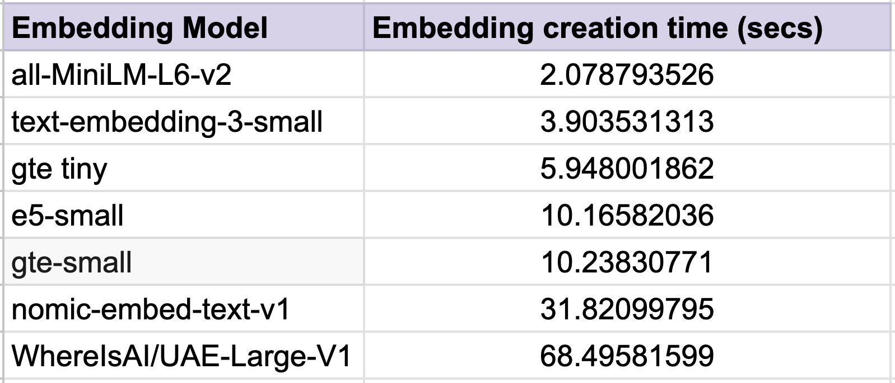

# Introducing AIMPED's DrugBot: Your Ultimate Medical Companion

<div style="text-align: justify;">
In the fast-paced world of healthcare, access to accurate and timely information is essential. AIMPED's DrugBot emerges as the ultimate solution, offering instant access to comprehensive details about medicines, drugs, and medical conditions. Let's explore how AIMPED's DrugBot is revolutionizing the way users access medical information.


## AIMPED's DrugBot: Your Personal Medical Encyclopedia
In today's digital age, navigating the vast landscape of medical information can be overwhelming. AIMPED's DrugBot simplifies this process by providing users with a seamless interface to query about medicines, drugs, and medical conditions. Whether you're a healthcare professional, a patient, or an enthusiast seeking reliable medical insights, DrugBot is your go-to companion.


## Who Can Benefit from DrugBot?
DrugBot caters to a diverse range of users across various industries and professions:
- <b>Healthcare Professionals:</b> Physicians, pharmacists, and medical practitioners can rely on DrugBot to quickly access drug information, dosage guidelines, and potential side effects, enhancing their decision-making process.
- <b>Patients:</b> Empowering patients to make informed decisions about their healthcare, DrugBot provides easy-to-understand explanations of medical terms, treatment options, and potential interactions between medications.
- <b>Students and Researchers:</b> Medical students and researchers can leverage DrugBot to access up-to-date information for academic purposes, aiding in literature reviews, case studies, and research projects.
    
    
## Real-World Scenarios: How DrugBot Can Help You
- <b>Medication Information Retrieval:</b> Imagine a scenario where a patient is prescribed a new medication but has concerns about potential side effects. DrugBot enables the patient to quickly and easily access detailed information about the medication, including dosage instructions, possible adverse reactions, and contraindications.
- <b>Drug Interaction Checks:</b> A pharmacist receives a prescription order for a patient who is currently taking multiple medications. To ensure there are no adverse drug interactions, the pharmacist uses DrugBot to conduct a thorough review of the patient's medication regimen, identifying any potential conflicts or contraindications.
- <b>Patient Education and Empowerment:</b> A patient is diagnosed with a chronic medical condition and seeks to better understand their treatment plan and prognosis. DrugBot serves as a valuable resource, providing the patient with clear explanations, educational materials, and lifestyle recommendations to support their journey towards improved health outcomes.
- <b>Emergency Response Support:</b> In a medical emergency where quick access to critical information is essential, first responders can rely on DrugBot to retrieve vital details about emergency medications, dosages, and administration protocols, ensuring prompt and effective patient care.

    
## Why Choose AIMPED's DrugBot?
- <b>Comprehensive Coverage:</b> DrugBot aggregates information from a reputable source, ensuring that users receive accurate and reliable data for their queries.
- <b>Ease of Use:</b> With its intuitive interface and conversational AI capabilities, AIMPED’s DrugBot offers a user-friendly experience, making it accessible to users of all technical backgrounds.
- <b>Continuous Enhancements:</b> AIMPED is committed to enhancing DrugBot's functionality by continuously updating its features to incorporate the latest advancements in the field of medicine. 


## How to Use:
To utilize AIMPED's DrugBot, simply navigate to the [Aimped's DrugBot](https://dev.aimped.ai/models/get-a-comprehensive-guide-to-medication-with-drug-assistant-464) page. From there, you can input your medical queries or drug-related questions directly into the chat window. DrugBot will promptly provide accurate information on medications, drug interactions, and medical conditions.


<div style="text-align: justify;">

## Technical Background: How DrugBot Works
Behind DrugBot's intuitive interface lies a sophisticated technical framework designed to deliver accurate and timely responses to user queries. Here's how it works:
- <b>Functionality:</b> DrugBot utilizes advanced scraping techniques to gather information from reputable sources such as [drugs.com](http://drugs.com/). When a user submits a query, DrugBot searches for relevant details on the specified medicine or medical condition, extracting data from the first available source.
- <b>Integration:</b> Leveraging OpenAI Function Calling, DrugBot seamlessly integrates with external APIs to fetch and process information. This integration enables DrugBot to deliver comprehensive responses tailored to the user's query.
- <b>Response Generation:</b> Once the relevant data is scraped, DrugBot passes it to another function responsible for generating user-friendly responses. By utilizing OpenAI's completion API, DrugBot formulates concise and informative answers based on the extracted context, ensuring that users receive actionable insights.
    
### Understanding the Chatbot Workflow
    

    
    
    
#### Explanation
- When a User inputs a message into the chatbot, the message undergoes processing through an <b>`OpenAI Function Calling`</b> method. This method initially assesses whether the input message pertains to medicine, a medical condition, or drugs. If the message does not align with these topics, the bot promptly responds, encouraging the user to ask a relevant question. 
Conversely, if the message is relevant, the method triggers a function call to extract details such as medicine names, medical conditions, or drug names from the user's query. These extracted parameters are then passed to a function called <b>`get_drug_info`</b>, which essentially serves as a web scraping script.
    
    
- Within the <b>`get_drug_info`</b> function, we utilize BeautifulSoup to scrape content from [drugs.com](http://drugs.com/), retrieving comprehensive details about the queried drug or medicine. Subsequently, we assess the token length of the scraped information. Given that we're utilizing <b>`gpt-3.5-turbo-0125`</b>, with a token capacity of 32K, we ensure that the token limit remains under 30K. If the token limit meets this criterion, we proceed to send both the scraped content and the user's query to OpenAI Completion API. OpenAI then formulates a tailored response based on the provided context, which is relayed back to the user via the frontend as the bot's response. 
    
    
- However, if the token length of the scraped content exceeds 30K, we encounter a token exceeding error. To address this issue, we adopt a strategy of selectively passing segments of the content whose combined tokens remain under 30K. Yet, determining which segments to pass presents a challenge. Simply selecting from the beginning up to 30K tokens risks omitting crucial information, potentially leading to incomplete responses from OpenAI.
    
    
- To circumvent this, we implement semantic search within the scraped content using a similarity search approach. Initially, we divide the text into smaller chunks, each containing fewer than 512 tokens, in consideration of the token limit imposed by the embedding model. Next, we generate embeddings for each chunk and compute the embeddings for the user's query. Subsequently, we calculate the similarity score between the user's query and each chunk, sorting the chunks in descending order based on their scores.
    
    
- Proceeding iteratively, we construct a new context by combining the sorted chunks until the token limit is reached. This iterative approach ensures that relevant information is preserved, mitigating the risk of overlooking pertinent details. Finally, we send this refined context along with the user's query to OpenAI for completion. The response generated by OpenAI is then tailored and presented to the user, ensuring a comprehensive and relevant interaction.

### Implementation Details: Exploring the Chatbot Code

#### Install necessary dependencies


```python
!pip install openai python-decouple tiktoken pydub requests BeautifulSoup4 numpy pandas tenacity sentence-transformers
```

#### Importing Libraries
The following Python code imports several libraries and modules necessary for various functionalities, including asynchronous operations, data processing, natural language processing (NLP), and web scraping.


```python
import asyncio
import datetime
import json
import os
import random
import time
from typing import Dict, Union
import openai
from openai import OpenAI
import uuid
from datetime import datetime
from decouple import config
from sentence_transformers import SentenceTransformer
import torch
import traceback
from decouple import config
from typing import Literal
import tiktoken
import functools
import requests
from requests.adapters import HTTPAdapter, Retry
from bs4 import BeautifulSoup
import numpy as np
import re
```

#### Setting OpenAI API Key and Defining Error Types

The provided code cell performs the following actions:

1. Sets the API key for OpenAI using environment variables and the `config` function.
2. Defines a tuple named `ERRORS` containing two error types: `openai.RateLimitError` and `ConnectionResetError`.

Ensure to replace `'OPENAI_API_KEY'` with the actual OpenAI API key.


```python
OPENAI_API_KEY = "sk-xxxxxxxxxxxxxxxxxxxxxxxxxxxxxxxxxxxxxxxxxxxxxxxx"
OpenAI.api_key = os.environ['OPENAI_API_KEY'] = OPENAI_API_KEY
ERRORS = (openai.RateLimitError, ConnectionResetError)
```

#### Logging Configuration Setup
Initializing logging for the Python script/module, allowing for logging messages with various severity levels such as INFO, WARNING, ERROR, etc., along with timestamps and other relevant information.


```python
import logging
# Configure the logger
logging.basicConfig(level=logging.INFO,format='%(asctime)s - %(name)s - %(levelname)s - %(message)s')
# Create a logger object
logger = logging.getLogger(__name__)
```

#### Drug Assistant and Expert Answer Generator Bot Prompt
The provided cell contains two prompts for different scenarios:
##### Drug Assistant Communication Prompt
Provides guidelines for a Drug Assistant, emphasizing accurate and detailed information provision about drugs, and redirects user queries unrelated to drugs or medicine.
##### Expert Answer Generator Bot Instructions Prompt
Defines the role of an Expert Answer Generator Bot, focusing on generating responses based on provided context and user questions, with specific instructions such as maintaining professionalism and delivering concise, relevant responses.

Both of these prompt are used later in this code.


```python
prompt = [
    {"role": "system",
     "content": """
         You are a Drug Assistant, a knowledgeable source for drug-related information. Your role is to provide accurate and detailed answers to the user's queries in a clear and structured manner, preferably in BULLET POINTS. If the input message is not related to drug/medicine, you MUST clearly state 'I am a Drug Assistant, so I cannot help with any other queries. Please ask your queries related to drugs/medicine'. It is crucial to rely on verified information and never fabricate responses. Maintain a professional tone and prioritize the user's need for reliable information.
     """},

    {"role": "user",
     "content": """
         "I have questions about medications and drugs. I need clear, detailed answers. Can you provide information about drug interactions, side effects, usage guidelines, and anything else related to drugs? Please ensure the information is accurate and easy to understand."
     """},

    {"role": "assistant",
     "content": """
         Hello! I am your Drug Assistant, here to provide detailed and accurate information about drugs. Whether you have questions about drug interactions, side effects, usage guidelines, or any other drug-related inquiries, I'm here to help. I'll present the information in a clear, structured format for easy understanding. If there's something I don't know, I'll be sure to tell you. How can I assist you today?
     """}
]

question_answer_prompt = [
    {
        "role": "system",
        "content": """
            You are a expert answer generator bot. You help users with their questions. Your job is to prepare answer from the context. User sends you 'Question' and 'Context'. You prepare your Answer from the given context.
            You MUST obey the following instructions FOR ALL RESPONSES:
            - ALWAYS generate Answers from the given context. DON'T makeup answers from yourself.
            - Your Answer should ALWAYS be properly formatted. Prefer to answer in HEADINGS and BULLET POINTS.
            - NEVER return the 'Context' as a final response. EXTRACT information asked in the question from it, then FORMAT it and return.
            - ALWAYS answer in professional tone.
            - ALWAYS answer TO THE POINT. DON'T return irrelevant details in response.
            - When user ask you to compare medicines. Compare their properties in proper HEADINGS and BULLET POINTS.
"""
    }
]
```

#### DrugInfoHelper

This Jupyter notebook cell defines a Python class `DrugInfoHelper`, which encapsulates various functionalities related to retrieving drug information and running conversations. Key features include:

- Initialization with API key, client, model details, and other parameters.


- Method `get_drug_info` to retrieve medication details from `drugs.com` based on provided details.
    - It takes medication_details as input, which represents the query for medication information.
    - The function splits the medication details into a list and removes any leading or trailing whitespace.
    - For each medication in the list, the function attempts to fetch data from the drugs.com website using HTTP requests. 
    - It uses BeautifulSoup library for scraping the content. It extracts the detail from the first most link from the HTTP response.
    - Upon successful retrieval, it extracts the medication details from the HTML response and appends it to the medicine_detail variable.
    - Finally, the function returns the accumulated medication details after logging the length of the extracted information.
    


- Method `run_conversation` to execute a conversation with the OpenAI Chat API, enabling automated responses and function execution based on the input message. This method basically utilizes OpenaAI Function Calling technique to run the `get_drug_info` function based on user's message.
    - Parses the input message to identify any function calls within it.
    - Constructs a list of functions to be considered during the conversation, including their names, descriptions, and parameters.
    - Sends the input message along with the list of functions to the OpenAI chat completion API.
    - Extracts the response from the API, which includes any generated content and information about function calls.
    - Checks if a function call is present in the response message.
    - If a function call is detected, matches the function name to its corresponding function in the codebase.
    - Invokes the identified function with the provided arguments extracted from the API response.
    - Sets a flag indicating whether a direct response from the API or a function response is returned.
    - Returns either the function response or the content directly from the API response, based on the presence of a function call..


- Utility methods like `clean_text` for removing HTML tags, `check_content_tokens` for verifying token limits, and others for text manipulation and analysis.


- Functions for creating sections, generating overlap, updating embeddings, and calculating cosine similarity.
    - `create_sections` to split the given text into smaller chunks. So that embeddings can be created for each chunk. Limits the chunk length to `512` due to the embedding model's limit.
    - `create_overlap` to create overlapping sections from a list of sections for enhanced context. It creates overlapped section inorder to avoid loss of information.
    - We employ `NumPy` arrays and list comprehensions during embedding creation, storage, and sections creation and overlappings, opting for them over Pandas or dataframe structures to enhance speed through the utilization of NumPy's efficient numerical computations.
    - `update_embeddings` to update embeddings for a list of sections using an embedding model.
    - `get_embedding` to obtain the embedding for a given text using an embedding model.
        - The embedding model utilized is `gte-tiny`. [TaylorAI/gte-tiny](https://huggingface.co/TaylorAI/gte-tiny) stands as an open-sourced embedding model. Preceding its selection, various other models underwent testing. Following careful comparison encompassing factors such as latency, model size, and accuracy, this model emerged as the optimal choice.
        <div style="text-align:center">
        
        </div>
    - `cosine_similarity` to calculate the cosine similarity between two embeddings.


- Method `prepare_prompt` for building prompts with retrieved contexts included. The `prepare_prompt` function constructs a complete prompt for the OpenAI chat model by combining the user's question with relevant context sections retrieved from previous interactions. This prompt is then used to generate a response from the model.
    - Calculate the tokens consumed by the system prompt and user's question.
    - Determine the number of tokens available for context sections by subtracting the consumed tokens from the total token limit.
    - Iterate over the context sections, adding them to the prompt until the token limit for context is reached.
    - Join the selected context sections into a single string.
    - Construct the complete prompt by combining the user's question, system prompt, and selected context sections.


- Method `answer` to generate a response from the OpenAI chat model based on the provided messages, such as user queries and contextual information. It utilizes the model to produce a response tailored to the input.


```python
class DrugInfoHelper:
    def __init__(self):
        self.OPENAI_API_KEY = OPENAI_API_KEY
        OpenAI.api_key = self.OPENAI_API_KEY
        self.client = OpenAI(api_key=self.OPENAI_API_KEY, max_retries=5, timeout=90)
        self.model = "gpt-3.5-turbo-0125"
        self.tokens_limit = 30000
        self.max_tokens = 1024
        self.temperature = 1 + random.uniform(0, 0.3)
        self.stream = False
        self.n = 1
        self.qna_prompt = question_answer_prompt
        self.encoding = tiktoken.get_encoding("cl100k_base")
        self.system = prompt[0]["content"]
        self.direct_response = False


    def get_drug_info(self, medication_details):
        logger.info("Get Drug Info function run: ✔")
        logger.info(f"Retrieved medication details from query: {medication_details} ✔")

        medication_details_lst = medication_details.split(",")
        medication_details_lst = [i.strip() for i in medication_details_lst]

        medicine_detail = ""
        
        for medicine_info in medication_details_lst:
            try:
                logger.info(f"Medicine Info: {medicine_info}")

                url = "https://www.drugs.com/search.php"
                params = {
                "searchterm": f"{medicine_info}",
                "a": "1"
                }

                response = requests.get(url, params=params)
                soup = BeautifulSoup(response.content, "html.parser")
                first_result = soup.find("div", class_="ddc-media-list ddc-search-results").find("a")
                if first_result:
                    href = first_result.get("href")
                    if href:
                        response = requests.get(href)
                        soup = BeautifulSoup(response.content, "html.parser")
                        result = soup.find("div", id="content")
                        if result:
                            logger.info(f"Length of content for {medicine_info}: {len(result.text)}")
                            medicine_detail += result.text + "\n"
                            break
            except Exception as e:
                logger.error(f"An error occurred: {e}. Retrying ({retry_count + 1}/{max_retries_on_exception})...")
                print("Full Traceback", traceback.format_exc())
                retry_count += 1
                time.sleep(delay_between_retries)  # Wait before retrying


        logger.info(f"Length of medicine detail extracted: {len(medicine_detail)} ✔")
        return medicine_detail


    def run_conversation(self, input_message):
        functions = [
            {
                "name": "get_drug_info",
                "description": "EXTRACTS medicine names, health conditions (e.g: headache, heart-attack), brand names or pill imprints (e.g: MP, I10) from input text. MUST see for MORE THAN ONE, MULTIPLE medicine names, health conditions, brand names or pill imprints. Return it with comma separated",
                "parameters": {
                    "type": "object",
                    "properties": {
                        "medication_details": {
                            "type": "string",
                            "description": "The names of the medicine/medicines, health conditions (e.g: headache, heart-attack), brand names or pill imprints (e.g: headache, heart-attack). Multiple medicine names, health conditions, brand names or pill imprints",
                        },
                    },
                    "required": ["medication_details"],
                },
            }
        ]

        response = self.client.chat.completions.create(
            model=self.model,
            messages=input_message,
            functions=functions,
            function_call="auto",
        )
        response_dict = json.loads(response.model_dump_json())
        response_message = response_dict['choices'][0]['message']

        if response_message.get("function_call"):
            available_functions = {"get_drug_info": self.get_drug_info}
            function_name = response_message["function_call"]["name"]
            function_to_call = available_functions[function_name]
            function_args = json.loads(response_message["function_call"]["arguments"])
            function_response = function_to_call(
                medication_details=function_args.get("medication_details"),
            )

            logger.info(f"Length of function response: {len(function_response)} ✔")
            self.direct_response = False
            return function_response, self.direct_response
        else:
            self.direct_response = True
            return response_message["content"], self.direct_response
        
    def clean_text(self, text):
        # Remove HTML tags
        text = re.sub(r'<[^>]+>', '', text)
        # Replace multiple spaces with a single space
        text = re.sub(r'\s+', ' ', text).strip()
        return text
        
    def check_content_tokens(self, text):
        self.under_limit = False
        encoding = tiktoken.get_encoding("cl100k_base")
        tokens = encoding.encode(text)

        if len(tokens) <= self.tokens_limit:
            self.under_limit = True

        return self.under_limit

    def create_sections(self, text):
        limit = 512
        encoding = tiktoken.get_encoding("cl100k_base")
        tokens = encoding.encode(text)
        chunks = [tokens[i : i + limit] for i in range(0, len(tokens), limit)]
        return [encoding.decode(chunk) for chunk in chunks]


    def create_overlap(self, sections):
        window = 5
        stride = 2
        return [' '.join(sections[i:min(len(sections), i + window)])
                for i in range(0, len(sections), stride)]


    def update_embeddings(self, sections, embedding_model):
        start_time = time.time()
        filtered_sections = [s for s in sections if s]
        embeddings = np.array([self.get_embedding(s, embedding_model) for s in filtered_sections])
        logger.info(f"Update embedding took: {time.time() - start_time}")
        return embeddings
    

    def get_embedding(self, text, embedding_model):
        start = time.time()
        embeddings = embedding_model.encode([text])
        logger.info(f"Chunk Embedding took: {time.time() - start}")
        return embeddings


    def cosine_similarity(self, a, b):
        return np.dot(a, b) / (np.linalg.norm(a) * np.linalg.norm(b))


    def prepare_prompt(self, prompt, results):
        tokens_limit = 16000
        # build our prompt with the retrieved contexts included
        user_start = f"\n\nQuestion: {prompt}"
        user_end = "Context:\n"

        system_prompt_content = self.qna_prompt[0]["content"]
        count_of_tokens_consumed = len(self.encoding.encode(f"\"role\":\"system\", \"content\":\"{system_prompt_content}\"{user_start}\n\n---\n\n{user_end}"))
        logger.info(f"Count of tokens consumed: {count_of_tokens_consumed} ✔")
        count_of_tokens_for_context = tokens_limit - count_of_tokens_consumed
        count_of_tokens_for_context = count_of_tokens_for_context - 1024 # 1024 token length of completion 
        logger.info(f"Count of tokens for context: {count_of_tokens_for_context} ✔")

        # Using list comprehension to gather context strings
        contexts = []
        for section in results:
            section_token_count = len(self.encoding.encode(section))
            logger.info(f"Section Token Count: {section_token_count}")
            if count_of_tokens_for_context >= section_token_count:
                contexts.append(section)
                count_of_tokens_for_context -= (section_token_count + 1)  # +1 for newline character
            else:
                break  # Early exit if token limit is reached

        # Joining all context strings in one operation
        contexts_str = "\n".join(contexts)
        logger.info(f"Total tokens of prepared context: {len(self.encoding.encode(contexts_str))}")
        complete_prompt = f"{user_start}\n\n---\n\n{user_end}{contexts_str}"
        logger.info(f"Total tokens of complete prompt: {len(self.encoding.encode(complete_prompt))}")
        return complete_prompt

    def answer(self, messages):
        logger.info("Getting into Answering")
        response = self.client.chat.completions.create(
            model=self.model,
            messages=messages,
            temperature=self.temperature,
            max_tokens=self.max_tokens,
            n=self.n,
            stream=self.stream,
        )
        response = json.loads(response.model_dump_json())
        logger.info("Before Return Answer")
        return response['choices'][0]['message']['content']
    
```

#### DrugInfoAssistant

This Jupyter notebook cell defines a Python class `DrugInfoAssistant`, which serves as an assistant for retrieving drug information and generating responses based on user input. Key functionalities include:

- Initialization with attributes such as system prompt, text, dataframe, sections, and helper class instance.
- Method `preprocessing` for preprocessing input messages, including running conversations using the `DrugInfoHelper`, cleaning text, creating sections, generating overlap, and updating embeddings.
- Method `generate_response` to generate responses based on user input, which involves preprocessing the input, checking content token limits, generating embeddings for the user's message, calculating similarities, sorting sections based on similarity scores, preparing prompts for the final answer, and generating the answer itself.

The assistant integrates extensively with the `DrugInfoHelper` class for various text processing and retrieval tasks, including logging, error handling, and integration with external APIs for drug information retrieval.


```python
class DrugInfoAssistant:
    def __init__(self):
        self.system_prompt = prompt[0]["content"]
        self.text = None
        self.sections = None
        self.new_sections = None
        self.drug_info_helper = DrugInfoHelper()
        self.direct_response = None
        self.limit_check = None


    def preprocessing(self, input_message, embedding_model):
        logger.info("Preprocessing started: ✔")
        self.text, self.direct_response = self.drug_info_helper.run_conversation(input_message)
        logger.info("Text extracted using function calling: ✔")

        if self.direct_response:
            logger.info("Direct response required, skipping additional processing.")
            return
        
        self.text = self.drug_info_helper.clean_text(self.text)
        
        self.limit_check = self.drug_info_helper.check_content_tokens(self.text)
        if self.limit_check:
            return

        # Create sections from the text
        self.sections = self.drug_info_helper.create_sections(self.text)
        logger.info("Sections created: ✔")

        # Create overlapped sections for more context
        self.new_sections = self.drug_info_helper.create_overlap(self.sections)
        logger.info("New overlapped sections created: ✔")

        # Update the embeddings for the new sections
        self.embeddings = self.drug_info_helper.update_embeddings(self.new_sections, embedding_model)
        logger.info("Embeddings updated: ✔")


    def generate_response(self, user_input, embedding_model):
        self.preprocessing(user_input, embedding_model)  # Update information based on user input
        logger.info("Preprocessing ended: ✔")
        
        if self.direct_response:
            logger.info("Direct response flag is True, returning text response directly.")
            logger.info(f"Assistant's content created: {self.text}")
            return self.text
        
        if self.limit_check:
            logger.info("Scraped content is under limit. Sending content directly to openai")
            # Generate the answer
            prepared_message = []
            prepared_message.append(question_answer_prompt[0])
            user_start = f"\n\nQuestion: {user_input[-1]['content']}"
            user_end = "Context:\n"
            complete_prompt = f"{user_start}\n\n---\n\n{user_end}{self.text}"
            prepared_message.append({"role": "user", "content": complete_prompt})
            try:
                assistant_reply = self.drug_info_helper.answer(prepared_message)
            except Exception as e:
                logger.error(f"Error while predicting:")
                return json.dumps({"status": False, "error": f"Sorry while generating content an error occurred. Please try again later. Error message:"})
            logger.info(f"Assistant's content created: ✔")
            return assistant_reply

        # Generate embedding for the user's last message
        prompt_embedding = self.drug_info_helper.get_embedding(user_input[-1]['content'], embedding_model)
        logger.info("Prompt embeddings created: ✔")

        # Calculate similarities using embeddings
        similarities = np.array([self.drug_info_helper.cosine_similarity(embed.flatten(), prompt_embedding.flatten()) for embed in self.embeddings])

        # Sorting the sections based on similarity scores
        sorted_indices = np.argsort(similarities)[::-1]
        sorted_sections = [self.new_sections[i] for i in sorted_indices]

        # Prepare the prompt for the final answer with sorted sections
        prepared_prompt = self.drug_info_helper.prepare_prompt(user_input[-1]["content"], sorted_sections)
        logger.info("Prompt prepared for final answer: ✔")

        # Generate the answer
        prepared_message = []
        prepared_message.append(question_answer_prompt[0])
        prepared_message.append({"role": "user", "content": prepared_prompt})
        assistant_reply = self.drug_info_helper.answer(prepared_message)
        logger.info(f"Assistant's content created: ✔")
        return assistant_reply
```

Defines a utility function `retry_with_exponential_backoff` for retrying asynchronous functions with exponential backoff.


```python
def retry_with_exponential_backoff(
        func,
        initial_delay: float = 1,
        exponential_base: float = 2,
        jitter: bool = True,
        max_retries: int = 10,
        errors: tuple = ERRORS):
    """Retry an async function with exponential backoff."""

    async def wrapper(*args, **kwargs):
        # Initialize variables
        num_retries = 0
        delay = initial_delay
        # Loop until a successful response or max_retries is hit or an exception is raised
        while True:
            try:
                # func is an async function
                return await func(*args, **kwargs)
            # Retry on specific errors
            except errors as e:
                # Increment retries
                num_retries += 1
                # Check if max retries has been reached
                if num_retries > max_retries:
                    raise Exception(f"Maximum number of retries ({max_retries}) exceeded.")
                # Increment the delay
                delay *= exponential_base * (1 + jitter * random.random())
                # Sleep for the delay
                await asyncio.sleep(delay)
            # Raise exceptions for any errors not specified
            except Exception as e:
                raise e

    return wrapper
```

#### DrugBot
Initializes the class `DrugBot` that serves as a model for text generation. 
This class represents a text generation model implemented for deployment using Kserve. It integrates with OpenAI's GPT-3.5 model, facilitates text generation based on received prompts, and manages audio generation if required. It utilizes various external services such as OpenAI for text generation, Sentence Transformer for embedding model.

Overall Functionality:
The KserveTextGeneration class initializes the model, loads necessary configurations, handles incoming requests for text generation, manages limitations on input size and usage, generates text responses using GPT-3.5, and provides functionalities for audio generation if requested.


Key components and functionalities of this class include:

- `Initialization`: The class initializes various attributes including model name, API keys, configuration parameters, and logger settings.

- `load` method: This method is responsible for loading the embedding model required for text processing. It utilizes the `SentenceTransformer` class to load the model from the specified directory.


- `ready_response` method: This method returns a predefined ready response in case of errors during initialization.


- `get_completion_from_messages` method: An asynchronous method that interacts with the OpenAI API to generate completions based on input messages. It configures parameters such as the model, temperature, max tokens, and stream for the completion request. Additionally, it utilizes exponential backoff for retrying in case of failures. 


- `predict` method: The `predict` method handles the prediction process for text generation based on the received payload. It processes the input payload, checks for input limitations, manages usage limits, generates text responses using GPT-3.5, handles audio generation if requested, and returns the generated response. The method logs various steps of the prediction process, including input processing, content generation, and any encountered errors.


These methods in `DrugBot` class encapsulates the functionality required for text generation, including initialization, model loading, request handling, response generation, audio conversion and error handling. It provides a comprehensive solution for serving text generation capabilities via an API endpoint. They are designed to operate seamlessly in a production environment, ensuring efficient and reliable text generation services.


```python
logger.info("Model dependencies imported and logger configured")
current_date = datetime.now().strftime("%d-%m-%Y %H:%M:%S")

class DrugBot:
    def __init__(self):
        self.ready = False
        self.model = "gpt-3.5-turbo-0125"
        self.OPENAI_API_KEY = OPENAI_API_KEY
        self.model_name = "TaylorAI/gte-tiny"
        self.load()
        self.device = "cuda" if torch.cuda.is_available() else "cpu"
        self.region_name = "us-east-1"
        self.embedding_model = None
        self.messages = []
        self.text = ""
        self.n = 1
        self.counter = 0
        self.max_tokens = 1024
        self.temperature = 1 + random.uniform(0, 0.3)
        self.data_type = ["data_json", "data_url_speak"]
        self.error_counter = 0
        self.drug_assistant = DrugInfoAssistant()
        self.client = OpenAI(api_key=self.OPENAI_API_KEY, max_retries=5, timeout=90)
        
        
    def extract_role_and_content(self, messages):
        # For getting rid of "processed" key
        original_messages = []
        for message in messages:
            if "role" in message and "content" in message:
                extracted_message = {
                    "role": message["role"],
                    "content": message["content"]
                }
                original_messages.append(extracted_message)
        return original_messages


    def load(self):
        try:
            self.embedding_model =  SentenceTransformer(self.model_name) # or path of model checkpoints' folder  
            logger.info("Model Loaded Successfully")

        except Exception as e:
            logger.error(f"Model couldn't load:{e}")
            print("Full Traceback", traceback.print_exc())
            return json.dumps({"status":False, "error":f"Model loading error: {str(e)}"})


    async def ready_response(self):
        ready_messages = ["Apologies, but I did not comprehend your statement. Would you kindly rephrase it for me?", 
                  
                  "Apologies for the inconvenience. An error has occurred. Kindly restate your request.",
                  "I apologize for the inconvenience caused by a technical difficulty, which resulted in my failure to comprehend your statement. Kindly request you to reiterate it, if you wouldn't mind.", 
                 ]
        self.error_counter += 1
        self.text = ready_messages[self.error_counter - 1]
        return json.dumps({"status": True, 
                                  "output": {
                                      "data_json": {
                                          "text": self.text,
                                          "extra_fields": self.extra_fields,
                                      }
                                  }
                                  })

    
    @retry_with_exponential_backoff
    async def get_completion_from_messages(self, messages):
        response = self.client.chat.completions.create(
            model=self.model,
            messages=messages,
            temperature=self.temperature,
            max_tokens=self.max_tokens,
            n=self.n,
            stream=self.stream,
        )
        return response


    async def predict(self, payload: Dict, headers: Dict[str, str] = None) -> Dict:
        try:
            if payload:
                logger.info(f"Payload received: ✔")
                self.extra_fields = payload['messages']
                logger.info(
                    f"Input messages(prompt) and params received: \n{self.extra_fields} \n max_tokens: {self.max_tokens} \n temperature: {self.temperature}")

                last_message = self.extra_fields[-1]["content"].strip()


            else:
                logger.info(f"No prompt messages received")
                return json.dumps({"status": False, "error": "No prompt messages received"})

 
            # CONTENT GENERATION
            try:
                self.messages = self.extract_role_and_content(self.extra_fields)
                logger.info(f"Generating content...")
                timer = time.time()
                OpenAI.api_key = self.OPENAI_API_KEY
                self.api_result = self.drug_assistant.generate_response(prompt + self.messages, self.embedding_model)
                logger.info(f"Content generated successfully in {time.time() - timer} seconds")
                text = self.api_result
                
                # OUTPUT
                self.extra_fields.append({"role": "assistant", "content": text})
                return {"status": True, 
                                  "output": {
                                      "data_json": {
                                          "text": text,
                                          "extra_fields": self.extra_fields,
                                          "raw_output": self.api_result
                                      }
                                  }
                                  }
                

            except Exception as e:
                if self.error_counter < 3:
                    return json.loads(await self.ready_response())
                else:
                    logger.error(f"Error while generating content: {str(e)}")
                    return json.dumps({"status": False, "error": f"Sorry while generating content an error occurred. Please try again later. Error message: {str(e)}"})
                

        except Exception as e:
            logger.error(f"Error while predicting: {str(e)}")
            return json.dumps({"status": False, "error": f"Sorry while generating content an error occurred. Please try again later. Error message: {str(e)}"})
            

        finally:
            logger.info(f"Predicting finished:✔")
            self.extra_fields=None
            self.text = ""
            self.messages = []
            logger.info(f"All variables are reset:✔")

```


    

### Running the DrugBot


```python
async def main():
    model = DrugBot()
    payload = {"messages": [
        {"role": "user", "content": "What are the side-effects of Paracetamol?"},
    ],
        "max_tokens": 1024,
        "temperature": 1,
    }
    
    res = await model.predict(payload)
    res = res['output']['data_json']['text']
    print("RES>>>" ,res)
    
            
if __name__ == "__main__":
    await main()
```

### Running DrugBot on Gradio Interface


```python
!pip install gradio==3.48.0
```


```python
import gradio as gr
import asyncio

# Your main function
async def main(inp_text, history):
    model = DrugBot()
    payload = {
        "messages": [{"role": "user", "content": inp_text}],
        "max_tokens": 1024,
        "temperature": 1,
    }
    res = await model.predict(payload)
    res = res['output']['data_json']['text']
    return res

# Creating the Gradio interface
iface = gr.ChatInterface(fn=main, title="DrugBot Chat")

# Running the interface
iface.launch()
```

<div style="text-align: justify;">
    
    
## Conclusion: Empowering Users with Knowledge
AIMPED's DrugBot stands as a testament to our commitment to revolutionizing healthcare through technology. By providing users with instant access to accurate and reliable medical information, DrugBot empowers individuals to take control of their health and make informed decisions. Experience the convenience and reliability of DrugBot today and unlock a world of medical knowledge at your fingertips.
Visit [aimped.ai](https://dev.aimped.ai/) now to engage with DrugBot and embark on a journey towards enhanced healthcare literacy and empowerment.
