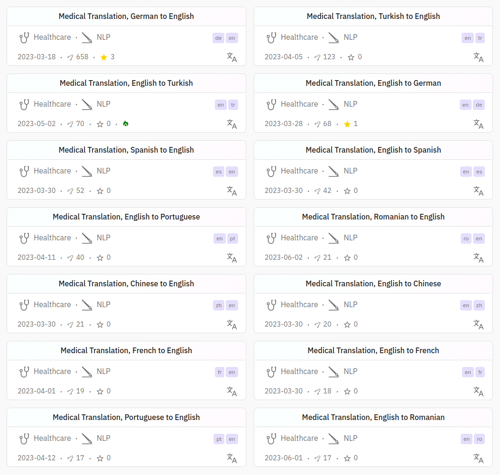
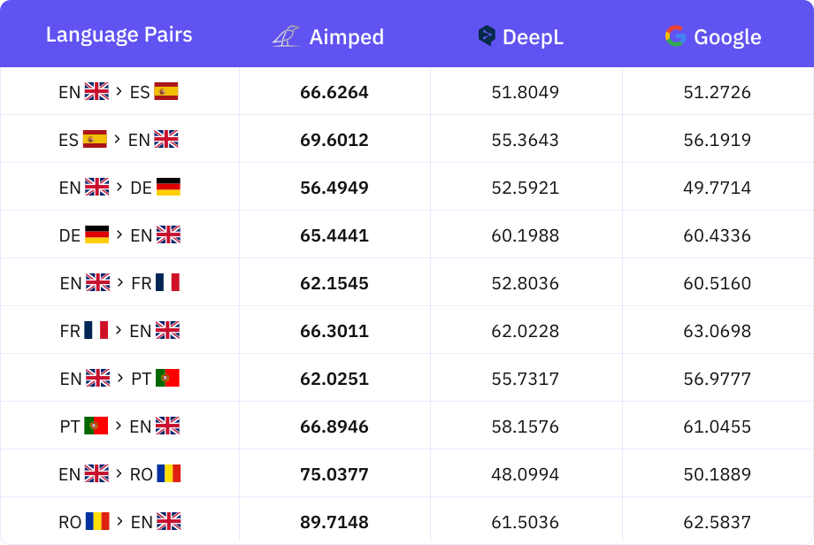
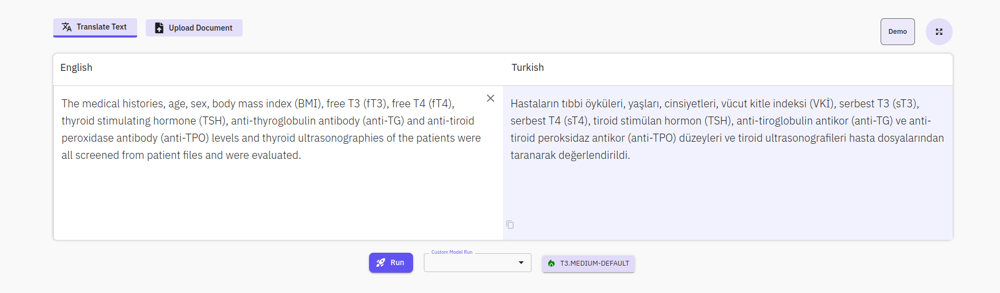

# LLMs-in-the-loop Part-1: Bio-medical and Clinical Text Translation using Expert Small Models.


<div style="text-align: justify;">

**Note:** A detailed scientific research paper on the methodology and findings of these Expert Small AI models will be published soon. Stay tuned for more in-depth insights and analysis.

**Medical document translation** plays a crucial role in the dissemination of health-related information globally. Health professionals and researchers continually advance their understanding, developing new treatments and medicines. The ongoing study of health relies on the swift and accurate translation of information, allowing researchers from diverse regions to access up-to-date knowledge efficiently. The process of medical document translation ensures that this vital information is conveyed accurately in various languages, facilitating seamless collaboration and knowledge exchange in the field of healthcare.

**Medical translation** is different from general translation and the accurate translation of documents such as clinical findings, patient files, research papers, and treatment guidelines plays a critical role in international medical communication. Medical translation involves not only word-for-word translation but also medical terminology, cultural differences, and disease-specific language structures. As such, it requires expertise and rigor.

**Medical machine translation models** are artificial intelligence-based systems developed to overcome these challenges. These models have the ability to translate medical documents quickly, accurately, and faithfully to specialized details between various languages. As Aimped, we have carried out meticulous work on preparing medical translation artificial intelligence models. We worked meticulously at every stage such as collecting and preparing the data and determining the architecture to be used for model training.



<h2>Training Data Curation:</h2> In our efforts to compile scientific publications in the field of medicine and establish accurate source and target language pairs, we employed both statistical and AI-based methods to achieve the most precise translations. Beyond basic statistical techniques—such as counting characters and words, and analyzing their ratios—we applied numerous advanced methods to ensure the highest similarity between sentences in the source and target languages.

In addition to leveraging these methods, we integrated the expertise of human translators who produced high-quality translation pairs. Furthermore, we utilized large language models (LLMs) to generate synthetic data, enriching our dataset with additional translation pairs.

To further enhance accuracy, we utilized transformer architectures to generate vectors that encapsulate the meaning of each sentence pair. We then measured the semantic similarity of these pairs using the cosine similarity method. Our results were filtered based on threshold values specifically tailored to each language pair's characteristics.

<h2>Selection of the train algorithm:</h2> We benefited from transformers architectures to train the models. Among these architectures, we decided that as a result of the tests and researches we made on the architecture of <a href="https://huggingface.co/docs/transformers/en/model_doc/marian">Marian MT</a>, it is a more ideal structure to train the medical translation model.

<h2>Training the models:</h2> The process of training the models is based on a number of experiments such as training et-test et-evaluation and then updating the training arguments according to the results obtained. In addition, according to the evaluation results, we realized that each language pair showed different features. The threshold values we set in the data preparation process and used to filter the data were also models we updated and re-prepared the data.
After the training and data preparation cycle, we decided the final training parameters and trained the final models. In the table below, you can see the scores obtained by the medical translation models.

<div class="responsive-image" style="text-align: center;">

</div>

**Use areas of Medical Translation models:**

- **Medical translation experts using medical translation models:**
  
    - **Terminology Formation:** It can help to translate specific terms. It can be used to obtain information about new or specific terms.

    - **Rapid Translation Transactions:** In case of emergency situations or in case of requires speed, medical translation specialists can use these models to make a fast and basic translation. This can enable them to gain time and provide a general understanding immediately.

    - **Document Analysis:** It can be used to analyze a large amount of documents quickly. This may be useful to create a summary or to identify similarities and differences between documents.

- **Medical Faculty Students:** Medical students can translate medical resources written in various languages in accordance with the medical literature using medical translation models quickly and accurately. In this way, they can gain a wider perspective about global medicine literature and practice.

- **Academicians:** Healthcare professionals who make an academic career can improve their knowledge by examining medical research published in various sources by exceeding the language barrier. Medical translation models help academicians to overcome the problem of language in the process of understanding and learning publications and research in the field of medicine and to improve their research and increase their knowledge and experience.

- **Doctors and Health Professionals:** Physicians can examine global clinical findings and developments in cases such as pandemic epidemics rapidly over the language barrier thanks to the ability of medical translation models to translate into the medical literature. In addition, they can use medical translation models in their routine work such as new treatment methods, information about medications or disease symptoms.

- **Pharmaceutical and Drug Research Companies:** Pharmaceutical companies can translate written materials such as research, thesis, article specific to the biomedical field using the medical translation model.


**How to Use:** You can easily use our translation models for the user interface by visiting the Aimped.ai site. In addition, you can use the medical translation models effectively through the API to integrate into your applications and either to present them to your customers.


Here are the Medical Translation models. <a href="https://aimped.ai/models?search=nlp-health-translation&page=1">Please click to visit model cards.</a>

<ul>
    <li>English-German</li>
    <li>German-English</li>
    <li>English-French</li>
    <li>French-English</li>
    <li>English-Portuguese</li>
    <li>Portuguese-English</li>
    <li>English-Romanian</li>
    <li>Romanian-English</li>
    <li>English-Chinese</li>
    <li>Chinese-English</li>
    <li>English-Spanish</li>
    <li>Spanish-English</li>
    <li>English-Turkish</li>
    <li>Turkish-English</li>
</ul>

**Developers** can seamlessly integrate our bio-medical and clinical text translation models into their applications or workflows via our API. [Here](https://github.com/ai-amplified/models/blob/main/tutorials/Bio-Medical%20and%20Clinical%20Text%20Translation.ipynb) is a quick tutorial to help you get started.
        
**You may want to review our <a href="https://aimped.ai/models?search=nlp-legal-translation&page=1">legal translation models.</a>**

---

## API Tutorial - Bio-Medical and Clinical Text Translation

### Short Description:
The Bio-Medical and Clinical Text Translation AI model is a specialized tool designed for precise translations of health science and medical documents from one language to another. Developed using the Helsinki/MarianMT neural translation architecture, it underwent intensive training with a diverse, high-quality dataset. This model ensures reliable and accurate translations of various medical documents, benefiting healthcare professionals and researchers by streamlining the complex task of medical language translation.

### Tutorial
This tutorial will guide you through using the Medical Translation API. By following the steps below, you'll be able to translate medical text from one language to another using the API. The main steps involved are:

1. Creating an access token
2. Installing the aimped library
3. Running the API with your credentials and payload

#### Step 1: Create Access Token
To use the API, you need an access token. Follow these steps to create one:

1. Go to the API Access Token Creation Page. You will land here: Token Creation Page
   
3. Select scopes and click on "Create Token".
4. After clicking this button, you will see the pop-up from where you can copy the User Key and User Secret.


4. Copy the generated access tokens and keep them safe. You'll need them for the next steps.

#### Step 2: Install aimped Library
To interact with the API, you need to install the aimped Python library. Open your terminal or command prompt and run the following command:

```bash
!pip install aimped==0.2.2
```

This command will install the necessary library to communicate with the API.

#### Step 3: Run the API
Now that you have your access tokens and the library installed, you can run the API to translate text. Follow these steps:

**Set up your credentials:**

```python
user_key = "YOUR_USER_KEY"
user_secret = "YOUR_USER_SECRET"
```

**Import the AimpedAPI class and set the base URL and model ID:**

For Medical Translation of other languages, you just need to change the Model ID. The Model ID can be found under "API Information" in the "API Details" tab on each model card.

```python
from aimped.services.api import AimpedAPI

BASE_URL = 'https://aimped.ai'
model_id = "10" # the Model ID can be found under "API Information" in the "API Details" tab on each model card.
```

**Initialize the API service:**

```python
api_service = AimpedAPI(user_key, user_secret, {"base_url": BASE_URL})
```

**Define your payload:**

Define payload according to your input data type.

Choose source and output language based on the model you are using.

**For Text input**

```python
payload = {
  "data_type": "data_json",
  "data_json": {
    "text": [
      "The MRI scan revealed significant abnormalities in the patient's frontal lobe, suggesting potential neurological issues.",
      "The patient should follow a low-sodium diet to manage their hypertension effectively and reduce cardiovascular risk."
    ],
    "source_language": "en", # Choose source_language based on your model's source language.
    "output_language": "tr"  # Choose output_language based on your model's output language.
  }
}
```

**For File Input**

```python
path_uri_obj = api_service.file_upload(
    model_id,
    '/Users/John/Downloads/sample.txt'  # sample file path to upload
)
path_uri = path_uri_obj['url']

payload = {
  "data_type": "data_txt",
  "extra_fields": {
    "source_language": "en", # Choose source_language based on your model's source language.
    "output_language": "tr"  # Choose output_language based on your model's output language.
  },
  "data_txt": [
      path_uri # Path of your text file
  ]
}
```

**Run the model:**

```python
result = api_service.run_model(model_id, payload)
```

If you're running this model for the first time or after a long time, you might see the following message:

```python
print(result)
{'message': 'We will notify you via email when the instance is ready.'}
```

Wait for the email notification indicating that the instance is ready. You will be notified on the Aimped as well.


You will see this notification, once the instance is ready:


Once you receive the email or notification on Aimped, run the model again:

```python
result = api_service.run_model(model_id, payload)
# Translated Text
result['output']['data_json']['result']['translated_text']
['MRG taraması hastanın frontal lobunda belirgin anormallikler gösterdi, bu da potansiyel nörolojik sorunları düşündürdü.',
 'Hasta, hipertansiyonlarını etkin bir şekilde yönetmek ve kardiyovasküler riski azaltmak için düşük sodyumlu bir diyet izlemelidir.']
```
**Limitations:** Our translation model has been meticulously designed and extensively trained to cater specifically to the demanding needs of the Healthcare and Biomedical domain. While it excels within this highly specialized realm, it's important to note that if you opt to employ the model in domains outside of healthcare, its performance may not meet the exceptional standards characteristic of the medical field. We advise a thoughtful consideration of this limitation when contemplating the model's application.
</div>


