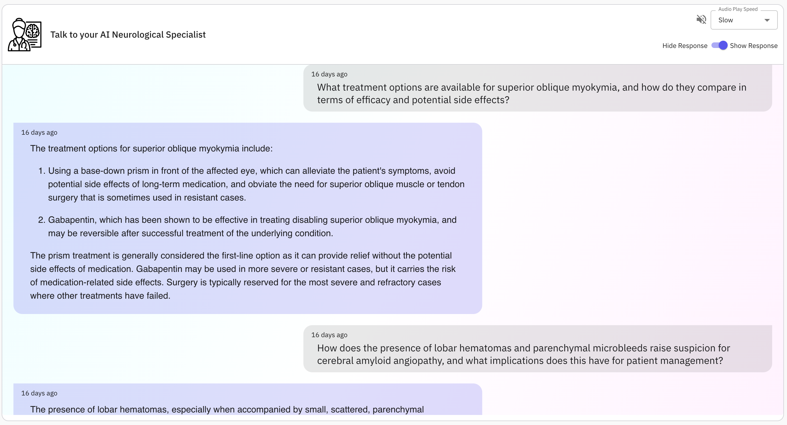
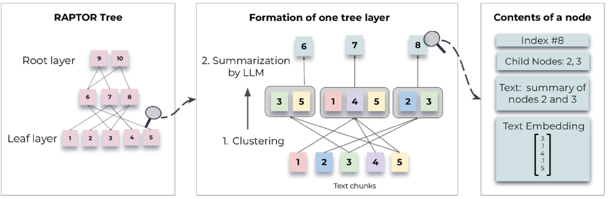
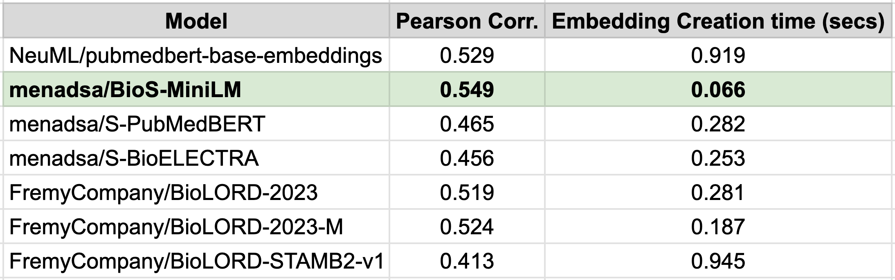

# AIMPED’s Neurology Assistant, a Comprehensive Guide for Neurological Insights

<div style="text-align: justify;">

Take a dive into the world of neurology with AIMPED's NeuroBot as your guide. This advanced chatbot is here to change how you learn about the brain. It utilizes the state-of-the-art Advanced RAG (Retrieval-Augmented Generation) mechanism. AIMPED's NeuroBot swiftly provides accurate responses by combining advanced retrieval methods with sophisticated context understanding. It simplifies complex medical concepts, making them easier to understand and digest.
  


    
What distinguishes AIMPED's NeuroBot is its unique Recursive Tree Architecture. Unlike typical models, our system uses a carefully organized tree structure for indexing and retrieval, enabling it to understand both broad concepts and fine details accurately. By grouping text chunks and creating summaries at different levels, NeuroBot builds a detailed tree hierarchy from scratch <b>*</b>. This smart setup makes it easy to move through lots of information and give accurate answers to any questions, no matter how complex.
    
Join the adventure with AIMPED's NeuroBot as your guide into the world of neurology. Witness how advanced tech and smart design make learning about the brain super exciting and understandable like never before.

## NeuroBot: Redefining Access to Neurological Information
Understanding neurology can be challenging, whether you're a medical expert or just someone curious about how the brain works. But with AIMPED's NeuroBot, you've got a friend to help you out. It makes learning about the brain easy and enjoyable, so you can explore neurology with confidence.


## Who Can Benefit from NeuroBot?
AIMPED's NeuroBot caters to a diverse audience, including:
- <b>Medical Professionals:</b> Neurologists, neurosurgeons, physicians, and medical students can rely on NeuroBot to access comprehensive information on neurological conditions, diagnostic procedures, treatment modalities, and more.
- <b>Patients and Caregivers:</b> Help patients and their caregivers with valuable insights into neurological disorders, NeuroBot gives them clear info about brain issues, treatment choices, and tips for living healthier.
- <b>Researchers and Academicss:</b> From conducting literature reviews to exploring cutting-edge research in neurology, NeuroBot helps them find the latest research and learn more about brain stuff.
- <b>General Enthusiasts:</b> Even if you're just curious about brains, NeuroBot is for you. It welcomes everyone to explore and learn more about the amazing world of neurology.


## Real-World Scenarios: How NeuroBot Can Help You
- <b>Diagnostic Assistance:</b> Imagine a physician has a tricky case with symptoms related to the brain. With NeuroBot's help, the physician can quickly find useful information to help diagnose the problem accurately and promptly treat the patient.
- <b>Patient Education:</b>  Let's say a patient has just been diagnosed with a brain issue and wants to learn more about it. NeuroBot can explain things in an easy way and share educational stuff so the patient feels more involved in their treatment.
- <b>Research Support:</b> Picture a neuroscience researcher studying a rare brain problem. NeuroBot can help by giving access to important research papers, case studies, and ongoing studies, helping push knowledge forward in the field.
- <b>Educational Tools:</b> Think of a student studying for medical exams. NeuroBot can help to make learning about the brain easier and more interactive, helping the student understand complex ideas better.


## Why Choose AIMPED's NeuroBot?
- <b>Cutting-Edge Technology:</b> NeuroBot utilizes advanced technology to swiftly provide tailored information from reliable sources, ensuring precise and relevant responses.
- <b>Reliability Guaranteed:</b> Trust NeuroBot to deliver accurate information thoroughly checked from trusted neurology sources.
- <b>Personalized Assistance:</b> Receive tailored support that fits your questions and preferences, regardless of your background.
- <b>User-Friendly Interface:</b> NeuroBot's intuitive design and conversational AI make it easy for users of all skill levels to engage with, ensuring accessibility for everyone.
- <b>Expand Your Knowledge:</b> Dive into the world of neurology and enrich your understanding with NeuroBot's extensive educational insights, presented in a clear and engaging manner.
- <b>Ethical Information Sourcing:</b> NeuroBot adheres to strict ethical standards in sourcing information, ensuring responsible content that upholds factual accuracy and integrity.


## How to Use
Accessing NeuroBot is simple and straightforward:
- Navigate to the [Aimped’s NeuroBot](https://aimped.ai/models/neurology-assistant-a-comprehensive-guide-for-neurological-insights-491)  webpage.
- Input your neurological query or topic of interest into the chat window.
- AIMPED's NeuroBot will promptly generate a response tailored to your query, providing accurate and insightful information on neurology-related topics.




## Technical Background: How AIMPED's NeuroBot Works
AIMPED's NeuroBot operates on an advanced RAG (Recursive Abstractive Generation) system, transforming the way users interact with neurology-related queries. Here's a simplified breakdown of NeuroBot's workflow:

- <b>Query Processing with Function Calling API:</b> When you ask a question, NeuroBot starts working using Anthropic's Function Calling API. First, it checks if your question is about neurology or similar topics. If it is, the API helps NeuroBot figure out more details or answers your question better. But if your question doesn't match, NeuroBot asks you to ask something more related to the topic.
- <b>Document Retrieval:</b> When user asks NeuroBot about neurology, it looks for helpful documents from a collection of open-source materials about neurology. 
    - <b>Resource Preparation:</b> We basically have various text collection of documents related to neurology like *proprietary and open-source clinical records, PubMed papers, and clinical neurology guidance books etc.*
    - <b> Tree Construction:</b>This collection is organized like a tree. Each part of the tree, called a node, holds important details from the documents.
    
    To find the right documents, NeuroBot starts by checking the list of these node details. By comparing these details, NeuroBot picks out documents that match your question best. It only brings back the most important and brief information, controlled by settings like `top_k` and `max_token`, so you get what you need quickly. All the picked documents are joined together to give you the full picture, but only up to a certain limit to keep things running smoothly.
- <b>Response Generation:</b> After finding the right documents, NeuroBot uses Claude LLM to make a helpful response. This response is designed to be easy to understand and helpful, giving accurate answers to your questions about neurology.

### Exploring NeuroBot's Tree Construction Process
NeuroBot's tree construction process is a crucial component of its workflow, enabling efficient retrieval of relevant documents. Here's an overview of how the tree construction process works:
- <b>Text Segmentation:</b>
The process begins by segmenting the retrieval corpus into short, contiguous texts of a fixed length. These texts serve as the basis for further processing and analysis.
- <b>Embedding and Clustering:</b>
The segmented texts are embedded using an embedding model, capturing their semantic and contextual information. Next, a clustering algorithm based on Gaussian Mixture Models (GMMs) is employed to group similar text chunks together.
- <b>Summarization:</b>
A Language Model is utilized to summarize the grouped texts within each cluster. This summarization process condenses the information while preserving its relevance and coherence.
- <b>Iterative Process:</b>
The cycle of embedding, clustering, and summarization continues iteratively until further clustering becomes infeasible. This iterative approach results in a structured, multi-layered tree representation of the original documents.
- <b>Efficiency and Scalability:</b>
An important aspect of NeuroBot's tree construction process is its computational efficiency. The system scales linearly in terms of both build time and token expenditure, making it suitable for processing large and complex corpora.
    


    

By constructing a comprehensive tree structure, AIMPED's NeuroBot ensures holistic understanding and efficient retrieval of relevant information, ultimately enhancing the quality of responses provided to users.


## Feedback:
The initial impression of NeuroBot is nothing short of astounding. Its ability to provide accurate and comprehensive responses to neurology-related queries are impressive and satisfying, establishing it as a reliable and indispensable medical companion.
Benchmarking and testing are currently underway to further assess AIMPED's NeuroBot's performance and effectiveness. Preliminary results from these efforts are promising, confirming AIMPED's NeuroBot's superiority and underscoring its potential to revolutionize the accessibility and interaction of neurology-related information.

</div>


## Implementation Details: Exploring the Chatbot Code

### Construction of Hierarchical Tree

#### Get and install necessary dependencies


```python
!pip install faiss-cpu numpy==1.26.3 scikit-learn sentence-transformers==2.2.2 tenacity==8.2.3 tiktoken==0.5.1 torch transformers==4.38.1 umap-learn==0.5.5 urllib3==1.26.6 anthropic
!git clone https://github.com/parthsarthi03/raptor.git
```

#### Pre-requisits
Before diving into the construction of the hierarchical tree, certain prerequisites need to be fulfilled:

- <b>Model Class Preparation:</b> Prepare model classes for summarization, question-answering (QA), and embedding generation by extending the `BaseSummarizationModel`, `BaseQAModel`, and `BaseEmbeddingModel` classes, respectively.
- <b>Resource Text Documents:</b> Gather the necessary text documents for building the hierarchical tree. In our case, a combination of proprietary and open-source clinical records, PubMed papers, and clinical neurology guidance books were utilized.

#### Models Selection
The selection of models for summarization, QA, and embedding is a crucial step in the construction process. For our purposes, we opted for the following:

- <b>Summarization and QA:</b> Anthropic Claude LLM was chosen. Specifically, we selected claude-3-sonnet-20240229 for summarization and claude-3-haiku-20240307 for QA.
- <b>Embedding Model:</b> 
Choosing the right embedding model for medical and healthcare tasks is crucial. To make the best choice, we compared different models using the BIOSSES benchmark dataset.


#### Benchmarking and Evaluation
To check how accurate our embedding model is, we need a dataset to compare it with. Since we're focusing on healthcare, it's best to use a dataset related to medical stuff. That's where BIOSSES comes in.

BIOSSES is a dataset made for figuring out how similar sentences are in the medical field. It has 100 pairs of sentences, all taken from articles about medicine. You can learn more about BIOSSES here.

Each pair of sentences in BIOSSES comes with a score. To test our models, we calculated the cosine similarity for each pair and then compared our model's score with the one in BIOSSES using Pearson correlation.

We also measured how long each model took to create embeddings for a text of about 500 words.

So based on the results, we have decided to use the `menadsa/BioS-MiniLM` embedding model. Below is the comparison result image.:


#### Utilities
The code snippet below defines three essential classes for different tree-building tasks, organized within a utilities module named `utils.py`:

- <b>BioSEmbeddingModel:</b> Utilizes the SentenceTransformer library to create embeddings for biomedical text data.
- <b>ClaudeHaikuQAModel:</b> Implements a question-answering model using the Anthropics API, interacting with the designated model "`claude-3-haiku-20240307`" to generate answers based on a given context.
- <b>ClaudeSonnetSummarizationModel:</b> Represents a summarization model powered by the Anthropics API, utilizing the designated model "`claude-3-sonnet-20240229`" to generate summaries of text data.


```python
from raptor import BaseSummarizationModel, BaseQAModel, BaseEmbeddingModel, RetrievalAugmentationConfig
from sentence_transformers import SentenceTransformer
import anthropic
import torch
import os
from tenacity import retry, stop_after_attempt, wait_random_exponential


class BioSEmbeddingModel(BaseEmbeddingModel):
    def __init__(self, model_name="menadsa/BioS-MiniLM"):
        self.model = SentenceTransformer(model_name)
        self.model.to("cuda")

    def create_embedding(self, text):
        encoded_text = self.model.encode(text)
        text_tensor = torch.tensor(encoded_text).to("cuda")
        text_tensor_cpu = text_tensor.cpu()
        return text_tensor_cpu.numpy()


class ClaudeHaikuQAModel(BaseQAModel):

    def __init__(self, model="claude-3-haiku-20240307"):
        self.model = model
        self.client = anthropic.Anthropic(api_key=os.environ["ANTHROPIC_API_KEY"])

    @retry(wait=wait_random_exponential(min=1, max=20), stop=stop_after_attempt(6))
    def _attempt_answer_question(self, context, question, max_tokens=1000, stream=False):
        response = self.client.messages.create(
            max_tokens=max_tokens,
            model=self.model,
            system="""You are Question Answering Portal. Your job is to answer the question from the given context. Answer the question under 1000 tokens without losing any information. Your answer must contain all the information required in the question. Don't mention "Based on the details provided in the context", just return the ANSWER only.""",
            messages=[
                {
                    "role": "user",
                    "content": f"Given Context:\n{context} \n Give the best full answer amongst the option to question:\n {question}",
                },
            ],
            temperature=0.2,
        )
        return response

    def answer_question(self, context, question, max_tokens=1000):
        try:
            return self._attempt_answer_question(context, question, max_tokens=max_tokens)
        except Exception as e:
            print(e)
            return e

        
class ClaudeSonnetSummarizationModel(BaseSummarizationModel):
    def __init__(self, model="claude-3-sonnet-20240229"):
        self.model = model
        self.client = anthropic.Anthropic(api_key=os.environ["ANTHROPIC_API_KEY"])

    @retry(wait=wait_random_exponential(min=1, max=20), stop=stop_after_attempt(6))
    def summarize(self, context, max_tokens=300, stop_sequence=None):
        try:
            response = self.client.messages.create(
            max_tokens=max_tokens,
            model=self.model,
            system="You are a helpful assistant. Your job is to summarize the given context of around 300 tokens. Don't miss any information, create summary containing all the details.",
            messages=[
                {
                    "role": "user",
                    "content": f"Write a summary of the following context, including as many key details as possible:\nContext{context}:",
                },
            ],
            temperature=0.1,
        )
            return response.content[0].text.strip()

        except Exception as e:
            print(e)
            return e
```

#### Tree Building

Now, a crucial step in building a tree structure, importing necessary modules and classes, and then configures and initializes an instance of the `RetrievalAugmentation` class.

- <b>Reading Source Documents:</b> The content of neurology source documents is read into memory.
- <b>Configuration Setup:</b> Configure the `RetrievalAugmentationConfig` (`RAC`) object, specifying the summarization, embedding, and QA models, along with other parameters.
- <b>Initialization:</b> Initialize an instance of the `RetrievalAugmentation` (`RA`) class using the configured `RAC`.
- <b>Adding Documents:</b> Add the source documents to the retrieval augmentation pipeline.
- <b>Saving Configuration:</b> Save the constructed retrieval augmentation tree to a specified location for future use.


```python
import os
from raptor import RetrievalAugmentation, RetrievalAugmentationConfig
from utils import ClaudeSonnetSummarizationModel, SBertEmbeddingModel, ClaudeHaikuQAModel, BioSEmbeddingModel

DOC_PATH = "path_of_your_documents.txt"
SAVE_PATH = "output/neuro_tree"

with open(DOC_PATH, 'r') as file:
    text = file.read()

RAC = RetrievalAugmentationConfig(summarization_model=ClaudeSonnetSummarizationModel(), 
                                  embedding_model=BioSEmbeddingModel(),
                                  qa_model=ClaudeHaikuQAModel(), tb_summarization_length=300)
RA = RetrievalAugmentation(config=RAC)

RA.add_documents(text)

RA.save(SAVE_PATH)
```

With these steps completed, the hierarchical tree is constructed and ready for further implementation.

#### NeuroAssistant
The code snippet facilitates interaction with the Claude AI system to provide neurology-related information in response to user queries.

`tools` list: Contains a dictionary specifying the available tools for neurology inquiries. In this case, there's one tool named `get_neuro_info` which retrieves answers for detailed neurology questions.

`NeuroAssistant` class: In its constructor method, it initializes the Claude API client using the provided API key, specifies the model name, and assigns the list of available tools.

The class includes several methods:
- `get_neuro_info`: Retrieves neurology-related information based on a detailed question provided by the user.
- `process_tool_call`: Processes the tool call and invokes the corresponding method based on the tool name.
- `chat_with_claude`: Facilitates communication with the Claude system. It sends the user's message to Claude and receives a response. If the response indicates the use of a tool, it further processes the tool's output and sends the final response back to the user.


```python
import anthropic
import re
from utils import ClaudeHaikuQAModel
import traceback
import anthropic


tools = [
    {
        "name": "get_neuro_info",
        "description": "Get the answer of the complete neuro related questions",
        "input_schema": {
            "type": "object",
            "properties": {
                "detailed_question": {
                    "type": "string",
                    "description": "Detailed question with Event, Entity, Group, Medical Conditions etc."
                }
            },
            "required": ["detailed_question"]
        }
    }
]


class NeuroAssistant:
    def __init__(self):
        self.client = anthropic.Anthropic(api_key=CLAUDE_API_KEY)
        self.model_name = "claude-3-haiku-20240307"
        self.tools = tools

    def get_neuro_info(self, detailed_question, RA):
        try:
            result = RA.answer_question_faiss(question=detailed_question)
            return result
        except Exception as e:
            print(e)
            print(f"Traceback: {traceback.format_exc()}")
            return f"Error in getting neuro answer: {str(e)}"

    def process_tool_call(self, tool_name, tool_input, RA):
        if tool_name == "get_neuro_info":
            return self.get_neuro_info(tool_input["detailed_question"], RA)

    def chat_with_claude(self, input_message, RA):
        print(f"\n{'='*50}\nUser Message: {input_message}\n{'='*50}")

        message = self.client.beta.tools.messages.create(
            model=self.model_name,
            system="You are the Neuro Bot, a knowledgeable source for neurology-related information. You ALWAYS use the TOOL if the question is related to medical condition, disease, patient, medical events etc. If the question seems missing the context, then complete it with the help of previous messages. Your role is to provide accurate and detailed answers to the user's queries in a clear and structured manner. If the input message is not related to neurology, you MUST clearly state 'I am the Neuro Bot, so I cannot help with any other queries. Please ask your queries related to neurology'. It is crucial to rely on verified information and never fabricate responses. Maintain a professional tone and prioritize the user's need for reliable information.",
            max_tokens=512,
            messages=input_message,
            tools=self.tools,
        )

        print(f"\nInitial Response:")
        print(f"Message: {message} ")
        print(f"Stop Reason: {message.stop_reason}")
        print(f"Content: {message.content}")

        if message.stop_reason == "tool_use":
            tool_use = next(block for block in message.content if block.type == "tool_use")
            tool_name = tool_use.name
            tool_input = tool_use.input

            tool_api_result = self.process_tool_call(tool_name, tool_input, RA)

            tool_result = tool_api_result.content[0].text.strip()

            response = tool_result
            return response

        else:
            response = message.content[0].text
            print(f"Returning direct response from CLAUDE:\n{response}")
            return response
```

The `get_neuro_info` function in the `NeuroAssistant` class above helps gather neurology information by using the features of the `RetrievalAugmentation` class. It mainly uses the `answer_question_fais`s function, which is a customized part of the `RetrievalAugmentation` class, to manage user questions efficiently.

The `answer_question_faiss` method within the RetrievalAugmentation class performs two essential tasks:

- Information Retrieval: This method invokes the `retrieve_information_from_faiss` method to retrieve relevant context chunks based on the user's query.`
- Answer Generation: Once the relevant context is obtained, the method utilizes a question-answering model (`qa_model`) to generate an answer to the user's query.

Below is the relevant code snippet demonstrating the `answer_question_faiss` method within the `RetrievalAugmentation` class:


```python
class RetrievalAugmentation:
    # Additional methods already present in this class:
    
    
    def answer_question_faiss(
        self,
        question,
        top_k: int = 10,
        max_tokens: int = 3500,
    ):
         """
        Answers the given question using information retrieved from FAISS index.

        Args:
            question (str): The question to be answered.
            top_k (int): The number of top results to consider.
            max_tokens (int): The maximum number of tokens to retrieve.

        Returns:
            str: The answer to the question.
        """
        context = self.retriever.retrieve_information_from_faiss(question, top_k, max_tokens)
        logging.info("Context prepared: ✔")
        answer = self.qa_model.answer_question(context, question)

        return answer
```

The `retrieve_information_from_faiss` function in the `TreeRetriever` class helps fetch relevant context pieces from a precalculated embedding index using the FAISS library. It was added as a custom feature to expand the capabilities of the `TreeRetriever` class.

Here's how the function works:

- Node List Retrieval: It gathers a list of nodes from a designated tree structure.
- Embedding Preparation: It calculates and stores the embeddings for each node in the node list.
- Index Setup: Using the FAISS library, it sets up an index based on the computed embeddings.
- Query Processing: The function handles the user's query, retrieves the most suitable context pieces based on the query using the FAISS index, and combines them to create the final context string.
Here's a code snippet demonstrating the implementation of the `retrieve_information_from_fais`s function within the `TreeRetriever` class:


```python
class TreeRetriever(BaseRetriever):
    # Additional methods already present in this class:

    
    
    # Custom method for retrieving information from FAISS index
    def retrieve_information_from_faiss(self, query: str, top_k: int, max_tokens: int) -> str:
        """
        Retrieves relevant information from the FAISS index based on the provided query.

        Args:
            query (str): The query string.
            top_k (int): The number of top results to retrieve.
            max_tokens (int): The maximum number of tokens to retrieve.

        Returns:
            str: The retrieved information.
        """
        node_list = get_node_list(self.tree.all_nodes)

        self.context_chunks = [node.text for node in node_list]

        self.embeddings = np.array(
            [node.embeddings[self.context_embedding_model] for node in node_list],
            dtype=np.float32,
        )

        self.index = faiss.IndexFlatIP(self.embeddings.shape[1])
        self.index.add(self.embeddings)

        query_embedding = np.array(
            [
                np.array(
                    self.create_embedding(query),
                    dtype=np.float32,
                ).squeeze()
            ]
        )

        context = ""
        self.use_top_k = True
        if self.use_top_k:
            _, indices = self.index.search(query_embedding, top_k)
            total_tokens = 0
            for i in range(self.top_k):
                # context += self.context_chunks[indices[0][i]]
                text = self.context_chunks[indices[0][i]]
                text_processor = TextProcessor()
                anthropic_client = text_processor.get_anthropic_client()
                tokens = anthropic_client.count_tokens(text)
                if total_tokens + tokens > max_tokens:
                    break
                total_tokens += tokens
                context += text

        else:
            range_ = int(self.max_context_tokens / self.max_tokens)
            _, indices = self.index.search(query_embedding, range_)
            total_tokens = 0
            for i in range(range_):
                tokens = len(self.tokenizer.encode(self.context_chunks[indices[0][i]]))
                context += self.context_chunks[indices[0][i]]
                if total_tokens + tokens > self.max_context_tokens:
                    break
                total_tokens += tokens

        return context
```

#### NeuroBot

##### Importing necessary libraries


```python
import datetime
import json
import logging
import os
import random
import time
from typing import Dict, Union
import requests
import uuid
from datetime import datetime
from decouple import config
from tools import api_sample, prompt, ready_messages
from raptor import RetrievalAugmentation, RetrievalAugmentationConfig
from utils import ClaudeSonnetSummarizationModel, BioSEmbeddingModel, ClaudeHaikuQAModel, SBertEmbeddingModel
from neuro_assistant import NeuroAssistant
import traceback
```

##### Logging Configuration Setup
Initializing logging for the Python script/module, allowing for logging messages with various severity levels such as INFO, WARNING, ERROR, etc., along with timestamps and other relevant information.


```python
import logging
# Configure the logger
logging.basicConfig(level=logging.INFO,format='%(asctime)s - %(name)s - %(levelname)s - %(message)s')
# Create a logger object
logger = logging.getLogger(__name__)
```

The `NeuroBot` class is the central part of a chatbot system designed to manage neurology-related questions. It handles user input, communicates with external APIs, and generates suitable replies. Here's a summary of its main features and attributes:

- `Initialization`: When created, the class sets up various attributes like API keys, message storage, and configurations for external APIs. It also prepares models and tools needed for processing queries.
- `extract_role_and_content` method: This function refine the incoming messages, keeping only the relevant role and content while discarding unnecessary data.
- `ready_response` method: If there are any errors during processing, this function sends a predefined response.
- `predict` method: The core function predicts responses based on user queries. It processes incoming data, generates content using the neurology assistant, and handles any encountered errors. This ensures the chatbot gives meaningful responses reliably.

Overall, the NeuroBot class manages the flow of information in the chatbot system, facilitating smooth interaction between users and the neurology assistance framework.


```python
current_date = datetime.now().strftime("%d-%m-%Y %H:%M:%S")
ANTHROPIC_API_KEY = "sk-xxxxxx"
os.environ['ANTHROPIC_API_KEY'] = ANTHROPIC_API_KEY


class NeuroBot:
    def __init__(self):
        self.ANTHROPIC_API_KEY = config("ANTHROPIC_API_KEY")
        self.messages = []
        self.text = ""
        self.api_result = None
        self.voice = None
        self.extra_fields = None
        self.stream = False
        self.counter = 0
        self.data_type = ["data_json", "data_url_speak"]
        self.error_counter = 0
        self.tree_path = "output/neuro_tree"
        self.neuro_assistant = NeuroAssistant()
        self.RAC = RetrievalAugmentationConfig(summarization_model=ClaudeSonnetSummarizationModel(), 
                                          embedding_model=BioSEmbeddingModel(),
                                          qa_model=ClaudeHaikuQAModel(), tb_summarization_length=300)
        self.RA = RetrievalAugmentation(config=self.RAC, tree=self.tree_path)
        
        
        
    async def extract_role_and_content(self, messages):
        # For getting rid of "processed" key
        original_messages = []
        for message in messages:
            if "role" in message and "content" in message:
                extracted_message = {
                    "role": message["role"],
                    "content": message["content"]
                }
                original_messages.append(extracted_message)
        return original_messages

        
    async def ready_response(self):
        ready_messages = ["Apologies, but I did not comprehend your statement. Would you kindly rephrase it for me?", 
                  
                  "Apologies for the inconvenience. An error has occurred. Kindly restate your request.",
                  "I apologize for the inconvenience caused by a technical difficulty, which resulted in my failure to comprehend your statement. Kindly request you to reiterate it, if you wouldn't mind.", 
                 ]
        self.error_counter += 1
        self.text = ready_messages[self.error_counter - 1]
        return json.dumps({"status": True, 
                                  "output": {
                                      "data_json": {
                                          "text": self.text,
                                          "extra_fields": self.extra_fields,
                                      }
                                  }
                                  })


    async def predict(self, payload: Dict, headers: Dict[str, str] = None) -> Dict:
        try:
            if payload:
                logger.info(f"Payload received: ✔")
                self.extra_fields = payload['messages']
            else:
                logger.info(f"No prompt messages received")
                return json.dumps({"status": False, "error": "No prompt messages received"})

            # CONTENT GENERATION
            try:
                self.messages = await self.extract_role_and_content(self.extra_fields)
                logger.info(f"Generating content...")
                timer = time.time()

                self.result, tokens_obj = self.neuro_assistant.chat_with_claude(input_message=prompt + self.messages, RA=self.RA)

                logger.info(f"Content generated successfully in {time.time() - timer} seconds")
                text = self.result

                # OUTPUT
                self.extra_fields.append({"role": "assistant", "content": text})
                return json.dumps({"used_credits" : self.used_credits,
                    "status":True,
                    "data_type":self.data_type,
                    "output":{"data_json":{"text":text},
                              "extra_fields":self.extra_fields,
                                }})

            except Exception as e:
                if self.error_counter < 3:
                    return json.loads(await self.ready_response())
                else:
                    logger.error(f"Error while generating content: {str(e)}")
                    return json.dumps({"status": False, "error": f"Sorry while generating content an error occurred. Please try again later. Error message: {str(e)}"})

        except Exception as e:
            logger.error(f"Error while predicting: {str(e)}")
            return json.dumps({"status": False, "error": f"Sorry while predicting an error occurred. Please try again later. Error message: {str(e)}"})

        finally:
            logger.info(f"Predicting finished:✔")
            self.api_result = self.extra_fieldsl = None
            self.text = ""
            self.messages = []
            logger.info(f"All variables are reset:✔")
```

## Running the NeuroBot


```python
async def main():
    model = NeuroBot()
    payload = {
        "messages": 
        [
            {'role': 'user', 'content': '"I have questions about neurology and neurological conditions. I need clear, detailed answers. Can you provide information about neurological disorders, symptoms, diagnostic procedures, treatment options, and anything else related to neurology? Please ensure the information is accurate and easy to understand."\n        '}, 
            {'role': 'assistant', 'content': "Hello! I am the Neuro Bot, here to provide detailed and accurate information about neurology. Whether you have questions about neurological disorders, symptoms, diagnostic procedures, treatment options, or any other neurology-related inquiries, I'm here to help. I ALWAYS uses the TOOLS to answer the queries. I'll present the information in a clear, structured format for easy understanding. If there's something I don't know, I'll be sure to tell you. How can I assist you today?\n        "}, 
            {"role": "user", "content": "What is EPILEPSY"}
        ],
    }
    
    res = await model.predict(payload)
    res = res['output']['data_json']['text']
    print("RES>>>" ,res)
    
            
if __name__ == "__main__":
    await main()
```

## Running NeuroBot on Gradio Interface


```python
!pip install gradio==3.48.0
```


```python
import gradio as gr
import asyncio

# Your main function
async def main(inp_text, history):
    model = NeuroBot()
    payload = {
        "messages": [{"role": "user", "content": inp_text}],
    }
    res = await model.predict(payload)
    res = res['output']['data_json']['text']
    return res

# Creating the Gradio interface
iface = gr.ChatInterface(fn=main, title="NeuroBot Chat")

# Running the interface
iface.launch()
```

## Future Directions: Specialized Subdomains

Even though there are lots of medical language models out there, the medical field is huge, so it's important to be really precise when using fancy technologies like RAG or training LLMs. This helps make sure they're super accurate and reliable. NeuroBot shows us that by focusing on specific areas like neurology, it can be even more accurate than those general medical models. And we are planning to dive into other areas like psychiatry, infection, and oncology. That means there's a bright future ahead for medical chatbots that really know their stuff in different medical fields.

<b>\* Citation:</b> 
  - [arXiv Link](https://arxiv.org/html/2401.18059v1)
  - Sarthi, Parth et al. "RAPTOR: Recursive Abstractive Processing for Tree-Organized Retrieval." In *International Conference on Learning Representations (ICLR)*, 2024.
